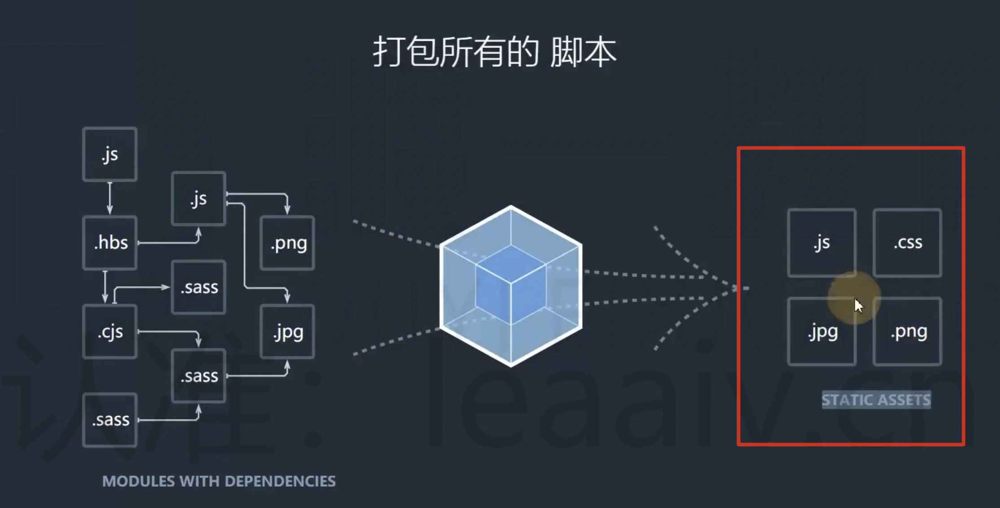

# 06 devtool 配置

## source map

很多时候不能直接运行源代码，可能会对源代码进行压缩、合并、转换等操作。

这就会给调试带来很大的困难，bundle.js 文件是压缩后的

为了解决这个问题，chrome 浏览器率先提供了对 source map 的支持。

source map 是一种配置，配置中记录了源码的内容，还记录了源代码的位置和压缩后的位置的对应关系。

总结：

source map 是为了在开发环境进行调试的一种手段。

不应该是用在生产环境，source map 文件比较大。

## Webpack 中使用 source map

webpack 会把源代码进行编译，无法进行调试。

通过 devtool 来优化调试。

development 模式默认开启 source map，production 可以通过 devtool 来开启。

devtool 的值：

- none，不会进行分离调试，生产环境的默认值

- eval，默认值，测试环境的默认值

...

详见：

https://v4.webpack.docschina.org/configuration/devtool/#%E5%AF%B9%E4%BA%8E%E5%BC%80%E5%8F%91%E7%8E%AF%E5%A2%83

https://v4.webpack.docschina.org/configuration/devtool/#%E5%AF%B9%E4%BA%8E%E7%94%9F%E4%BA%A7%E7%8E%AF%E5%A2%83