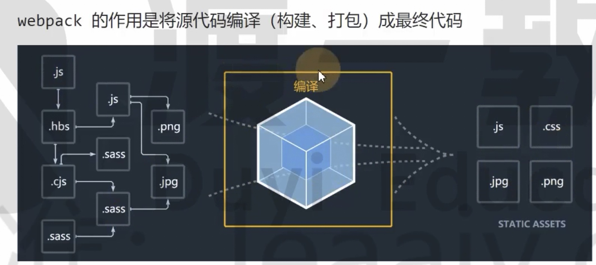
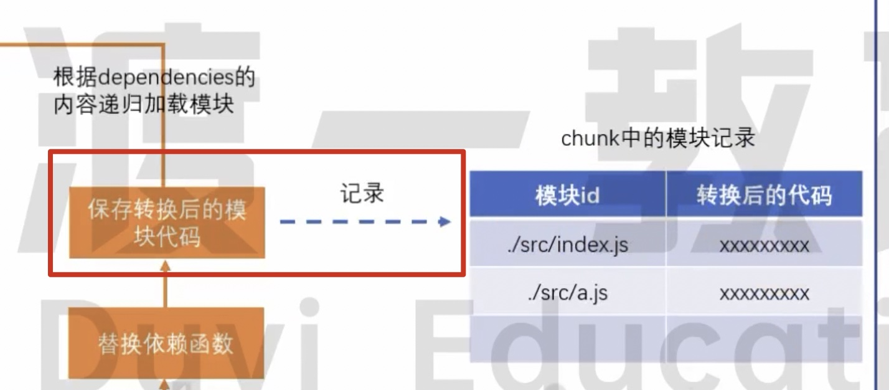
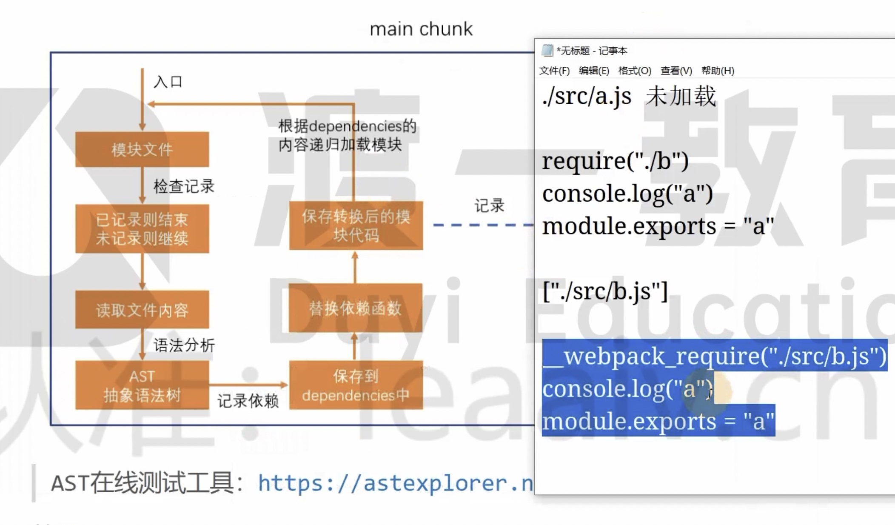
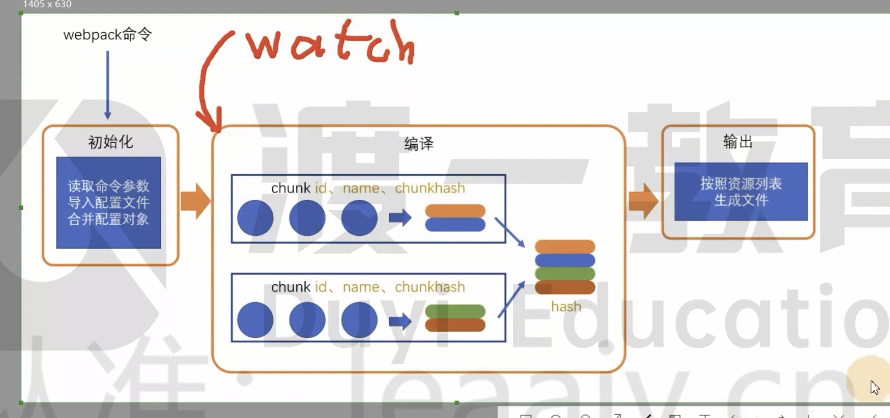

# 07 编译过程



整个过程分为三个步骤：

1、初始化

2、编译

3、输出

## 初始化

Webpack 将 CLI、webpack 配置文件、Webpack 的默认配置进行融合，形成最终的配置对象。

目的就是为了融合配置内容。

## 编译

### 1、创建 chunk

chunk 是 Webpack 内部构件的一个概念，意为「块」，简单认为一个文件，一个 chunk 包含多个模块。

index.js => a.js => b.js

编译为一个 main.js 文件，这个文件就是 chunk 块

chunk 会有多个，目前只有一个入口 chunk。

chunk 有两个属性：

1. name：默认为 main

2. id：唯一序号，开发环境和 name 相同，生产环境为数字，从 0 开始

### 2、构建所有依赖

```js
console.log("index");
require("a");
require("b");
```

入口文件 =》分析依赖 =》生成 AST 树

1. 寻找入口文件 src/index.js

2. 检查这个模块是不是已经被加载（在表格检查记录，表格开始是空的）

3. 读取模块内的代码

4. 解析模块依赖关系，产生 AST 抽象语法树

https://astexplorer.net/

```js
console.log("index");
require("a");
```

利用算法进行树形结构遍历，分析 require()、import 找到所有依赖

5. 保存到 dependencies 中 ["./src/a.js", "./src/b.js"]

6. 替换依赖函数

```js
// 转换后的代码
console.log("index");
__webpack_require("./src/a.js");
__webpack_require("./src/b.js");
```

7、保存转换后的模块代码



8.根据 dependencies 记录的内容进行递归加载模块



最终会形成一个完整的表格。

### 3、输出

第二部完成后，chunk 中会产生一个模块列表，列表中包含了模块的 ID 或模块转换后的代码

webpack 会根据配置为 chunk 生成一个资源列表，也就是 chunk assets

资源列表理解为最终生成文件的文件名称和文件内容

>>>

chunk hash：

根据所有的 chunk assets 生成一个 hash 字符串。

hash：

一种算法，用于生成一个字符串，字符串长度固定，字符串内容唯一，相同的输入，生成的 hash 字符串一定相同。

然后合并多个 chunk，产生一个总的 hash，

### 3、输出

利用 node 的 fs 模块，根据总的 assets 生成相应的文件

开启 watch 后，每一次文件变化都会从「编译」的步骤开始执行

