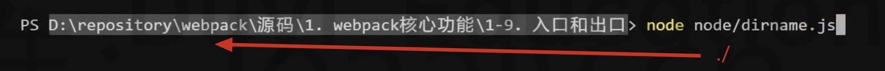
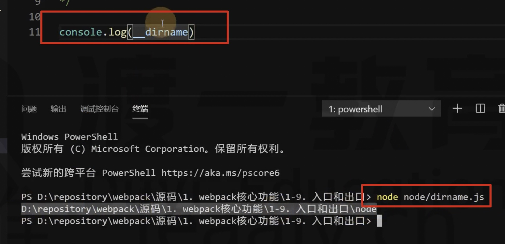
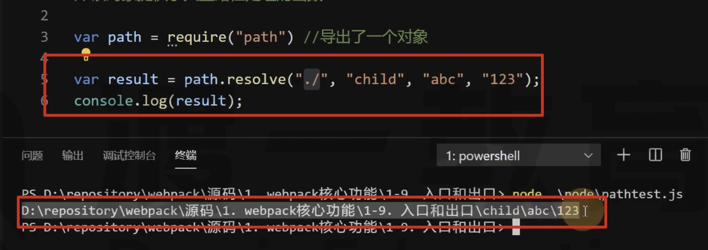
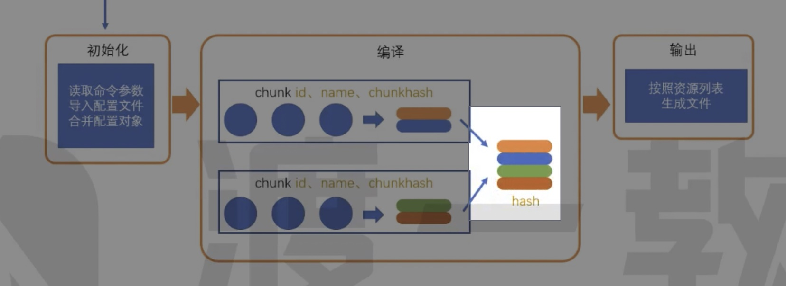
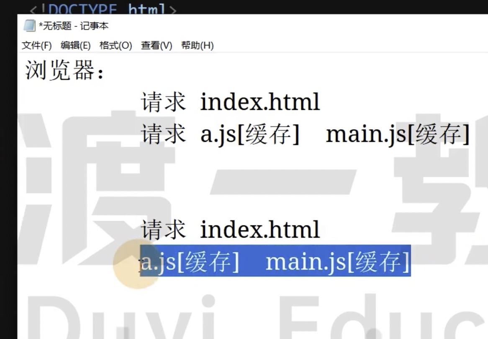
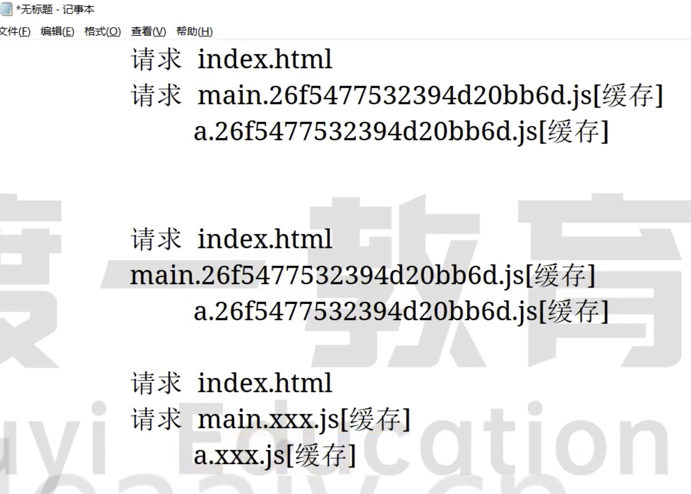

# 08 入口和出口

## Node 知识

node 环境中：

./

1. 模块化代码中，require("./") 表示当前 js 文件所在的目录

2. 在路径[或者文件]处理中，./ 表示 Node 运行目录



\_\_dirname

所有情况下都表示当前 js 文件所在的目录，是一个绝对路径



Node 内置模块 path

```js
// 返回一个对象
const path = require("path");
```

对象提供了大量路径处理的函数：

- path.reslove([...paths]) 将路径或路径片段的序列解析为绝对路径，是跨平台的。



## 出口



出口针对的是资源列表的文件名或者路径的配置

是一个对象，有很多属性，通常使用的就几个

```js
module.exports = {
    mode: "production",
    output: {
        // path 必须是一个绝对路径，表示资源要放置的文件夹，默认是 /路径/xxx/dist
        path: path.resolve(__dirname, "target"),
        // filename 配置的是资源的文件名，资源非常多到底配置的是哪个资源的名字呢？
        // 资源来自于多个 chunk 的合并，chunk 的资源来自于模块合并的结果
        // 配置的是合并的 JS 的规则
        // 静态写法 "bundle.js" "js/sbundle.js"
        // 动态写法
        filename: "js/bundle.js"
    }
};
```

动态写法的值，一个占位符：

- [name] 

- [hash:5] 5 表示取 5 位，这个 hash 值总资源的 hash，也就是所有 chunk 组合成的 hash，一个 chunk 改变，其他的 chunk hash 也会改变

- [chunkhash] 相比 hash ，只有对应的 chunk 发生变化，hash 才会变化，不会影响到其他的 chunk

- [id] chunk 的 id

为什么需要 hash？

因为每次打包，文件名都是不一样的，这样缓存就失效了



应该让文件名发生变化，这样缓存就失效了，每次请求新的 js 文件，所以 hash 就是为了解决浏览器缓存的问题。

只要文件内容不变，hash 就不会变



## 入口

入口配置不是入口文件

入口配置的是 chunk，有哪些 chunk


entry 配置的是有几个 chunk，每个 chunk 叫什么名字

默认只有一个

```js
// entry: "./src/index.js" 会转换为下面的对象形式
entry: {
    // 默认的配置
    // key 是 chunk 的名称
    // value 是入口模块（启动模块）
    main: "./src/index.js",
    // 可以配置多个 chunk
    login: "./src/login.js"
}
```