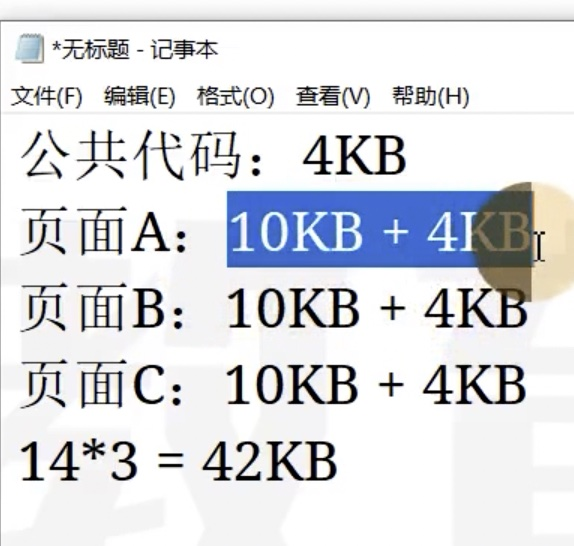
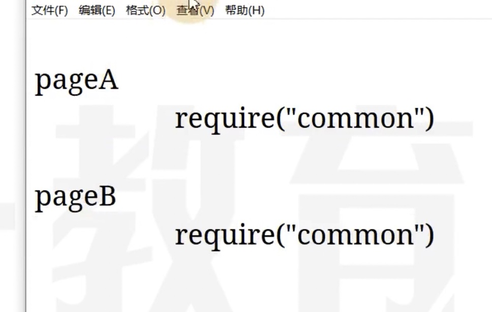

# 09 入口和出口的联系

## 一个页面一个 JS

```txt
|- src
    |- pageA
        |- index.js
    |- pageB
        |- index.js
    |- pageC
        |- main1.js
        |- main2.js
    |- common
```

```js
module.exports = {
    entrt: {
        pageA: "./src/pageA/index.js",
        pageB: "./src/pageB/index.js",
        pageC: ["./src/pageC/main1.js", "./src/pageC/main2.js"]
    },
    output: {
        filename: "[name].[chunkhash:5].bundle.js"
    }
};
```

适合页面之间没有联系的情况，差异巨大，公共代码较少的

否则，pageA、pageB、pageC 都会打包一份公共代码 common





造成请求体积变大

如果把公共代码抽离，就是 34kb，因为浏览器会缓存 common 的代码

后面学习如何抽离公共代码

## 一个页面多个 JS

```txt
|- src
    |- pageA
        |- index.js
    |- pageB
        |- index.js
    |- statistics
        |- index.js
    |- common
```

```js
module.exports = {
    entrt: {
        pageA: "./src/pageA/index.js",
        pageB: "./src/pageB/index.js",
        statistics: "./src/statistics/index.js"
    },
    output: {
        filename: "[name].[chunkhash:5].bundle.js"
    }
};
```

如果 pageA 和 pageB 没有使用到 statistics 的代码，那么 statistics 是可以被单独提取的

例如 statistics 对页面进行初始化，和页面主功能没有联系

## 单页面应用

单页面应用是指只有一个页面，页面所有的内容全部考 JS 创建和控制，Vue 和 React

```txt
|- src
    |- subFunc
        |- index.js
    |- subFunc
        |- index.js
    |- common
    |- index.js
```


```js
module.exports = {
    entrt: "./src/index.js",
    output: {
        filename: "[name].[chunkhash:5].bundle.js"
    }
};
```