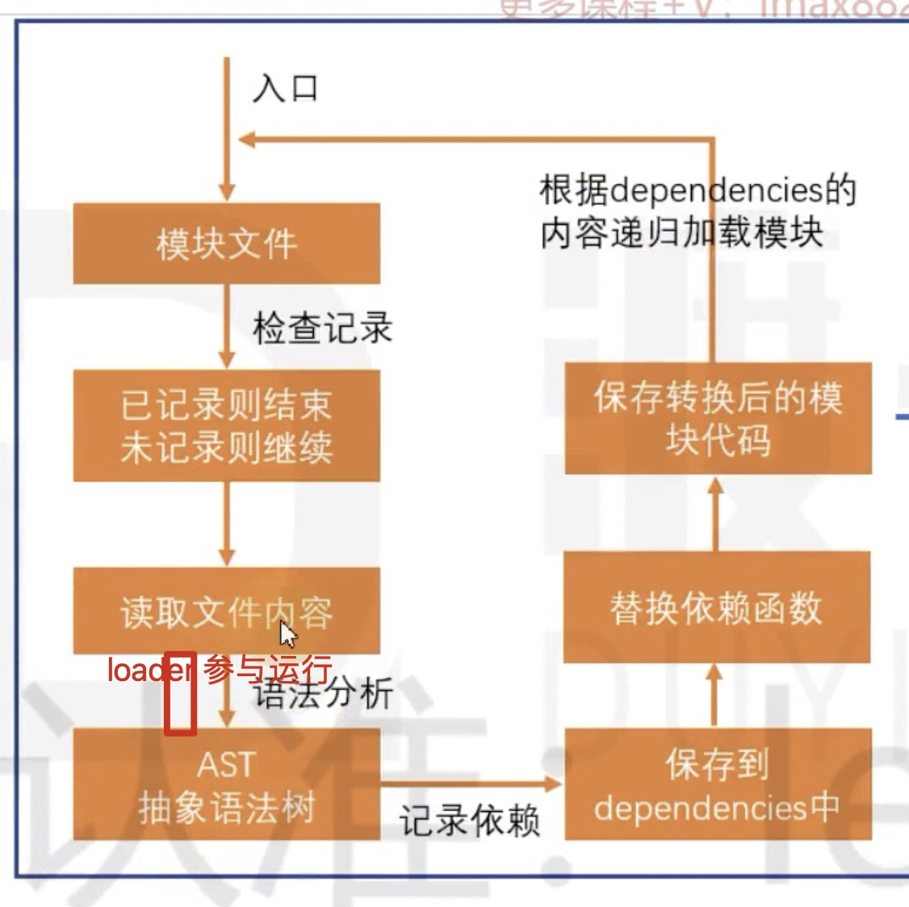
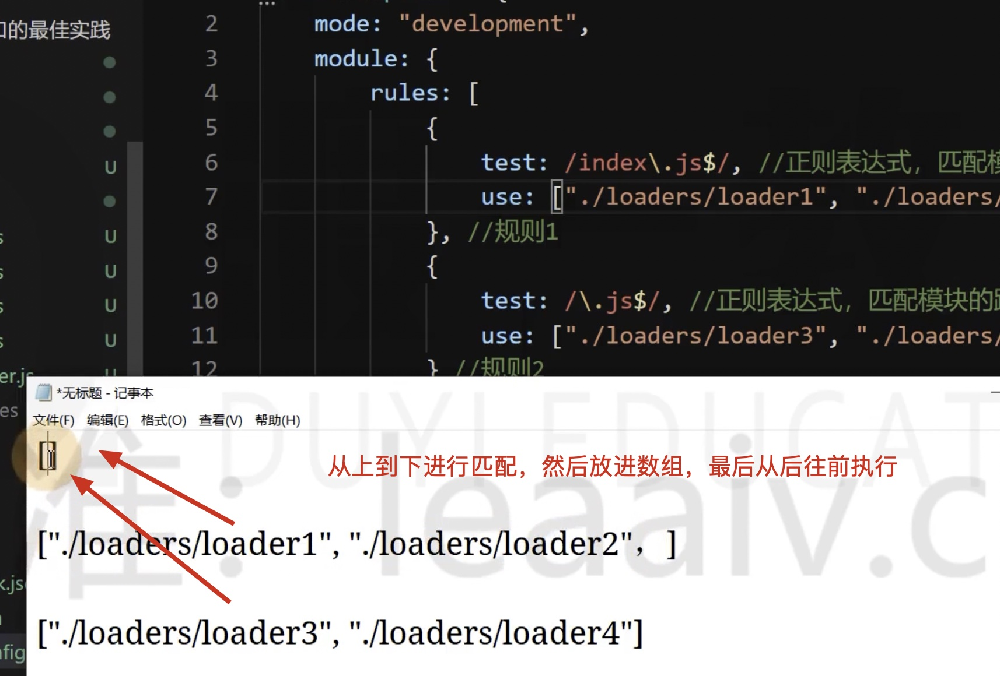

# 10 loader

Webpack 分析各种模块的依赖关系，然后产生资源列表，最后打包到指定文件中。

更多功能需要使用 loader 和 plugin 来拓展使用。

loader 本周就是一个函数，作用就是把源码字符串转换为另外一个源码字符串返回。

<!-- 图片 -->

```js
变量 a = 1;
```

无法解析，发生错误，使用 loader 来解决



如何处理 loader？

1、判断是否满足某个规则

2、是否要交给 loader 来处理

3、loader 可以是多个，串联执行

## loader 的配置

```js
module: {
    // 模块的匹配规则
    rules: [
        // 规则1
        // 规则2，从下往上看，先看规则2
        {
            // 正则表达式，匹配模块的路径，如果匹配成功，就要使用对应的 loader
            test: /index\.js$/,
            // 要使用哪些加载器
            use: [
                // 每一个加载器的使用是一个对象
                {
                    // 表示加载器的loader, webpack 会自动加载
                    loader: "./loader/test-loader"
                }
            ]
        }
    ]
    // 是否不要解析某个配置
    // noParse:
}
```

loader 可以更改源代码



案例：

index.js

require(./a.js)

a.js


loader 只能使用 commonJS，不能使用 ESModule，因为 loader 是要参数 webpack 打包的，webpack 打包是运行 Node 环境的