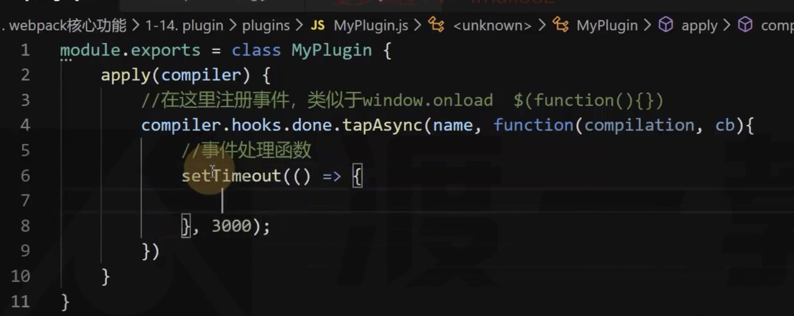
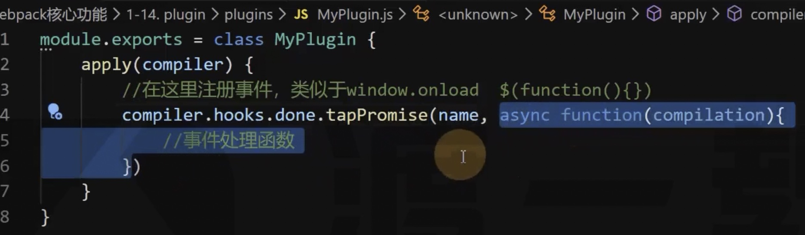

# 13 plugin

Loader 的定位是转换代码

拓展功能还需要 Plugin 的参与

Plugin 可以认为就是来注册事件的！

事件非常的多，我们只学几个，Plugin 可以监听事件。

Plugin 本质上就是一个带有 apply 方法的对象：

```js
var plugin = {
    apply: function (compiler) {
        // 注册事件
    }
};
```

通常，更习惯编写为构造函数的模式：

```js
class MyPlugin {
    apply(compiler) {
        // 注册事件
    }
}
```

使用：

```js
const path = require("path");
const MyPlugin = require("./plugins/MyPlugin");

module.exports = {
    mode: "development",
    plugins: [new MyPlugin()]
};
```

## compiler

compiler 是一个对象，意味编译器，是「初始化」阶段被创建

Webpack 打包的时候只有一个 compiler 对象，剩下的全部交给 compilation 对象

compiler 和 compilation 的区别：

当文件发生变化的时候，不会从初始化开始，而是从编译阶段开始，所以不会重复创建 compiler，而是重复创建 compilation

## apply 函数

会在初始化阶段创建好 compiler 对象后运行

演示：

1、webpack.config.js 配置 watch

2、使用 插件

3、打包查看控制台输出

4、更改 index.js 文件内容，查看控制台输出

5、结果，apply 只会在第一次执行的时候执行

然后需要使用 apply 函数内注册事件

把 apply 理解为 window.onload

如何注册？

```js
class MyPlugin {
    apply(compiler) {
        // console.log("插件运行了！")
        compiler.hooks.事件名称.事件类型(name, function (compilation) {
            // 事件处理函数
        });
    }
}
```

事件类型

主要是告诉 Webpack 我这个函数有没有处理完成，用哪种方式告诉 Webpack





```js
class MyPlugin {
    apply(compiler) {
        // console.log("插件运行了！")
        // 名称随便写，主要是为了调试
        compiler.hooks.done.tap("MyPluginTest", function (compilation) {});
    }
}
```

done 事件表示整个编译完成的时候

开启 watch 的时候，更改 index.js 文件，done 事件也会重新执行

compilation 也可以注册勾子：

```js
class MyPlugin {
    apply(compiler) {
        compiler.hooks.beforRun.tap("MyPluginTest", function (compilation) {
            compilation.hooks.xxx.xxx("xxx", function () {});
        });
    }
}
```
