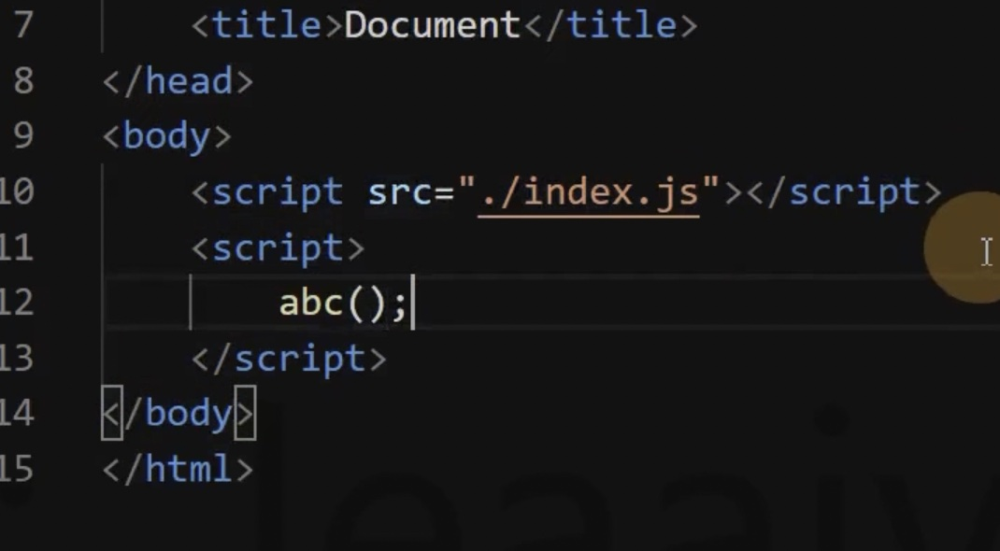
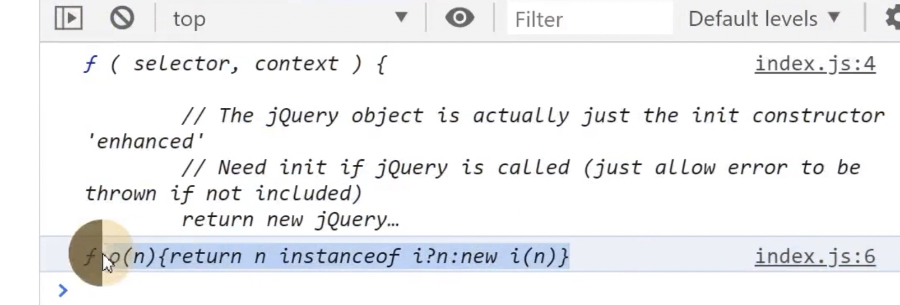

# 16 其他补充

目标：

1、知道这个能干什么

2、怎么做的，忘记就忘记了，只要会查文档就行

> （抓大局，放细节，具体用到的时候才重要，不用的时候不重要，只要脑子里知道它能干啥就行）

## context

```js
context: path.resolve(__dirname, "app");
```

影响入口和 Loader 的解析

entry 的配置默认从当前执行路径解析的（命令行提示的路径）。

通过 context 来更改解析的位置。

## output.library

```js
output: {
    library: "";
}
```

library 会把自动执行函数的返回内容暴露给 abc（详见 dist/main.js）

类似这样

```js
var abc = (function () {
    // 代码执行
})();
```

abc 得到的是入口文件 src/index.js 导出的结果

开发的时候没意义，某些情况有必要：

1、和一些插件联合使用，插件要求提供一个全局变量

2、开发一个工具库的时候提供给别人使用（例如 jQuery）,这样别人 script 我们 JS 文件的时候就可以直接输出这个 abc 变量



## output.libraryTarget

和 library 配合使用，指定 library 的输出形式

```js
module.exports = {
    mode: "development",
    output: {
        library: "abc",
        libraryTarget: "umd"
    }
};
```

libraryTarget 的可选值：

## target

设置打包的目标环境，例如 window、node 等

```js
targer: "window";
```

有什么区别？

```js
const fs = require("fs");
```

这个时候，target 是 window， node_modules 下没有 fs 模块，因为 fs 模块是 Node 的内置模块

影响的是模块依赖的解析

## module.noParse

```js
module: {
    noParse: /jquery/;
}
```

配置的是不要解析（加载）某些模块，不对 jquery 进行任何操作，直接把 jquery 源码放在模块内容中

为什么不需要解析呢？

因为 jquery 的源代码非常的大，分析会比较耗时，且 jquery 已经经过打包工具进行了打包，因此就没必要对这个文件进行解析了

通常用来忽略大型的单模块库（不能有其他的依赖），以此开提供构建性能

## resolve.modules

```js
resovle: {
    // 默认配置，可以是多个，从一个模块中找不到就去第二个路径中去找
    modules: ["node_modules"];
}
```

```js
let $ = require("jquery");
```

Webpack 分析模块的时候通过 require 来分析，默认回去 node_modules 下面寻找依赖，如果找不大到就往后执行

## resolve.modules

```js
resovle: {
        modules: ["node_modules", "abc"],
        extensions: [".js", ".jsx", ".ts", ".tsx"]
    }
```

查找模块的时候，Webpack 会尝试补全后缀名进行查找，不是 Node，因为 Webpack 会分析模块依赖，分析的时候会根据 require 查找依赖

## resolve.alias

配置别名

```js
resovle: {
        modules: ["node_modules", "abc"],
        extensions: [".js", ".jsx", ".ts", ".tsx"],
        alias:{
            "@":path.resolve(__dirname, "./src")
        }
    }
```

```js
const index = require("@/index.js");
```

这样就会到 src 的目录下查找 index.js 文件，有的时候如何嵌套的太深，这个配置会非常的实用

```js
require("../../../../../demo.js");

// 改写为
require("@/demo.js");
```

## externals

```js
externals: {
        jquery: "$",
        lodash: "_"
    }
```

```js
require("jquery");
require("lodash");
```

这样打包出的代码非常的多，行数特别的长

我们希望把 jquery 和 lodash 使用 CDN 来使用

表示遇到哪些包不需要 Webpack 管理，不需要产生最终的打包结果，因为这些模块我们自己处理了，告诉 Webpack 遇到这些模块的时候直接使用一个 $ 或者 _ 即可

因为 CDN 中的 jquery 已经存在全局 $ 变量



## stats

控制的是构建过程中输出的内容

https://v4.webpack.docschina.org/configuration/stats/