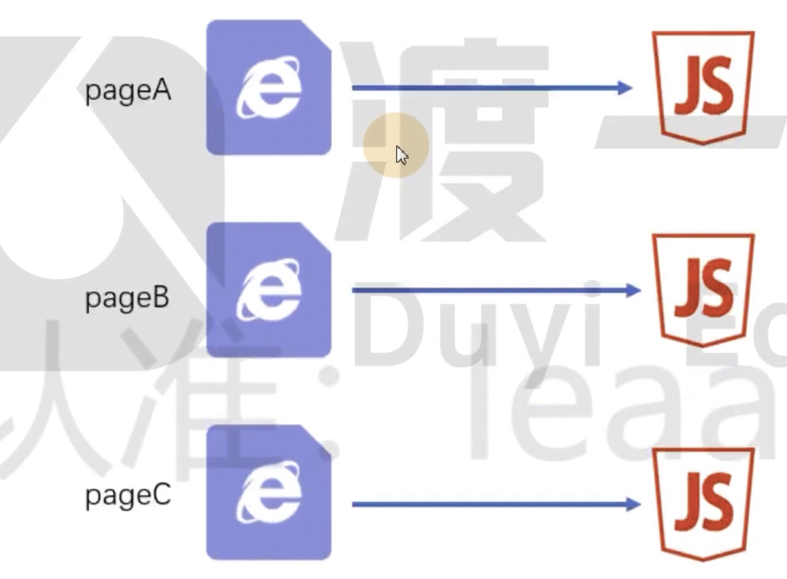

# 18 自动生成 html 文件

html-webpack-plugin 插件可以自动生成 html 文件，并且可以自动引入打包后的 js 文件。

目前问题：

Webpack 打包完成后产生 JS 文件，但是 JS 文件需要在页面上运行，Webpack 有没有产生 html 文件

我们需要手动创建一个 html 文件，然后引入打包后的 js 文件

但是，当 JS 文件更改后我们还需要创建、手动的导入

```bash
$ npm i html-webpack-plugin@4 -D
```

详见 17demo 目录

如果之间进行实例化就会产生一个很简单的 HTML 文件

 new HtmlWebpackPlugin()

插件还容许我们传递一些参数，例如给他一个默认的模版

然后就会按照我们的模版导入 JS 文件

如果有两个 chunk ，HtmlWebpackPlugin 也会全部导入

还有一种情况就是一个页面导入一个 JS 文件



配置 chunks 属性

表示生成的 html 页面，要使用哪些 chunks

默认值是 all 全部的 chunks 都导入

里面填写的是 chunk 的名称

如果想要实现多个 html 页面导入对应的 JS 文件怎么做？

可以多调用 ，HtmlWebpackPlugin 插件即可