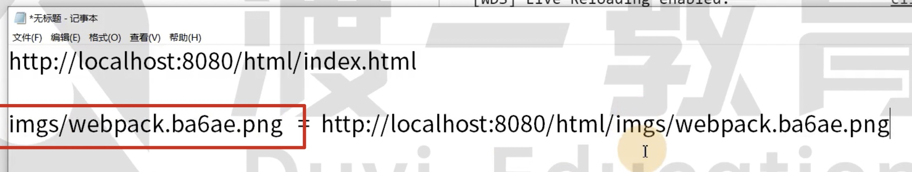
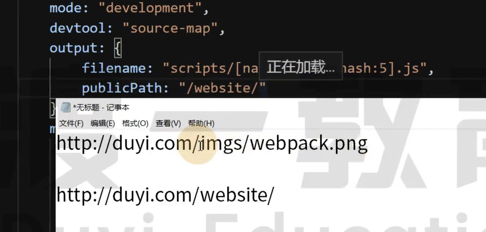

# 22 解决路径的问题

```js
module.exports = {
    mode: "development",
    output: {
        filename: "js/[name].[chunkhash:5].bundle.js"
    },
    module: {
        rules: [
            {
                test: /\.jpeg$/,
                use: [
                    {
                        loader: "url-loader",
                        options: {
                            name: "imgs/[name].[hash:5].[ext]",
                            limit: 1 * 1024
                        }
                    }
                ]
            }
        ]
    },
    plugins: [
        new CleanWebpackPlugin(),
        new HtmlWebpackPlugin({
            template: "./public/index.html",
            filename: "html/index.html"
        })
    ]
};
```

打包后运行 HTML 文件，无法加载图片资源

加载的时候是 dist/html/imgs/template.59ac3.jpeg 路径，图片显示 404

为什么？

图片是 file-loader 打包的，生成的是 imgs/template.59ac3.jpeg，他知道图片的位置

他只知道图片的位置保存到哪里，他不知道 JS 的文件在哪里，更不知道 HTML 文件在哪里

图片导入是在 main.js 内部实现的

所以，导致图片无法加载



造成这个问题的根本原因就是模块的路径来自于 Loader 或者 Plugin，当产生路径的时候，只是相对于 dist 目录的，并不知道路径会在哪个资源中被使用。无法确定最终的路径

通过 publicPath

这个时候 dist/main.js 文件内的 **webpack_require**.p = ""; 为我们配置的字符串路径

这个属性是不被调用的，而是提供给别人使用的

有些 Loader 和 Plugin 需要使用这个属性，告诉他们图片的路径，所以需要谨慎配置

```html
<body>
    <div id="app"></div>
    <script src="/js/main.8944b.bundle.js"></script>
</body>
```

一般来说，都会进行拼接

所以 webpack_require 本身没啥用，但是插件会使用，然后进行拼接


就是一个字符串，可以随便写

所以 publicPath 一般都是一个 / 跟路径



根据需求动态配置的，没有固定的答案

如果两个地方用法 publicPath 不同，每个插件可能会提供一个单独的 publicPath

```js
module: {
        rules: [
            {
                test: /\.jpeg$/,
                use: [
                    {
                        loader: "url-loader",
                        options: {
                            name: "imgs/[name].[hash:5].[ext]",
                            limit: 1 * 1024,
                            publicPath: "../"
                        }
                    }
                ]
            }
        ]
    },
```
