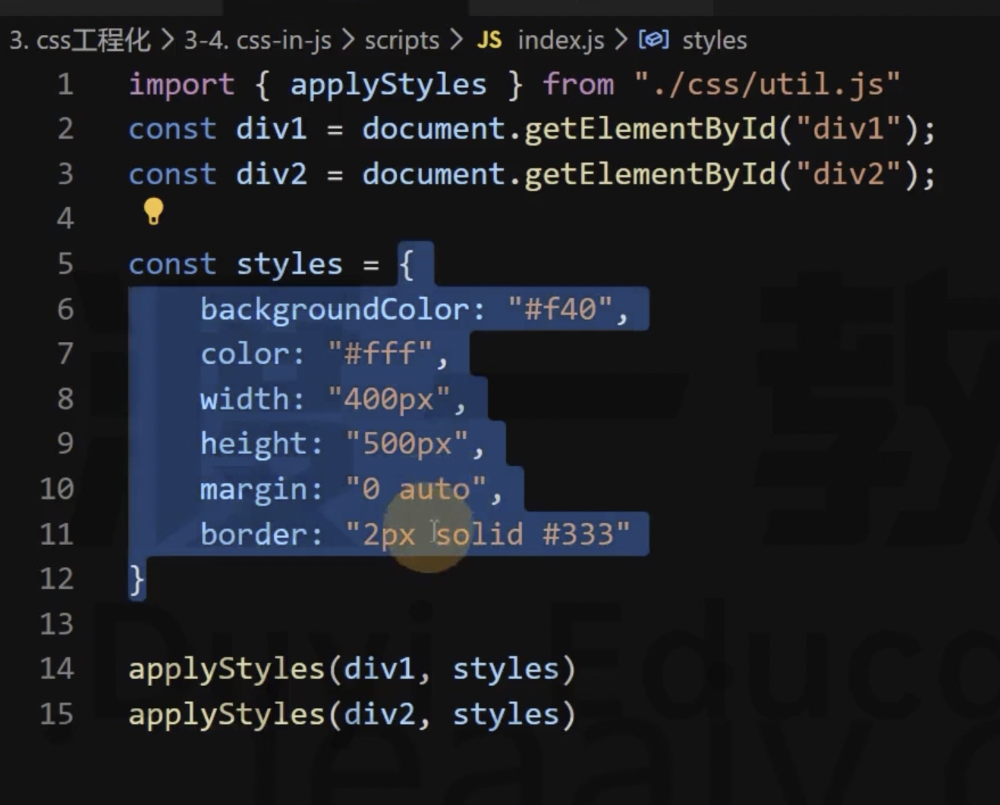

# 27 BEM & CSS in js & CSS Module

## BEM

主要是为了解决类名冲突的问题

在 BEM 中不建议使用嵌套选择器

本章和 Webpack 没有关系，就是一种命名规范

```css
.xxx .xxx .xxx {
}
```

## css in js

这种方式非常的激进

```js
const styles = {
  backgroundColor: "red",
  color: "white",
  width: "100px"
};
```



## CSS Module

详见 26demo

命名规范和 css in js 的缺点。

在 Webpack 中使用 css-loader 使用了 CSS module 的思想

```js
{
        test: /\.css$/,
        use: ["style-loader", "css-loader?modules"]
      }
```

如何应用样式呢？


```js
import common from "./style/common.css";

// style-loader 还会把 css-loader 的内容进行简化
console.log(common);

// 使用 JS 获取元素后设置重置类名
document.querySelector(".box").className = common.box;
```

## 全局类名