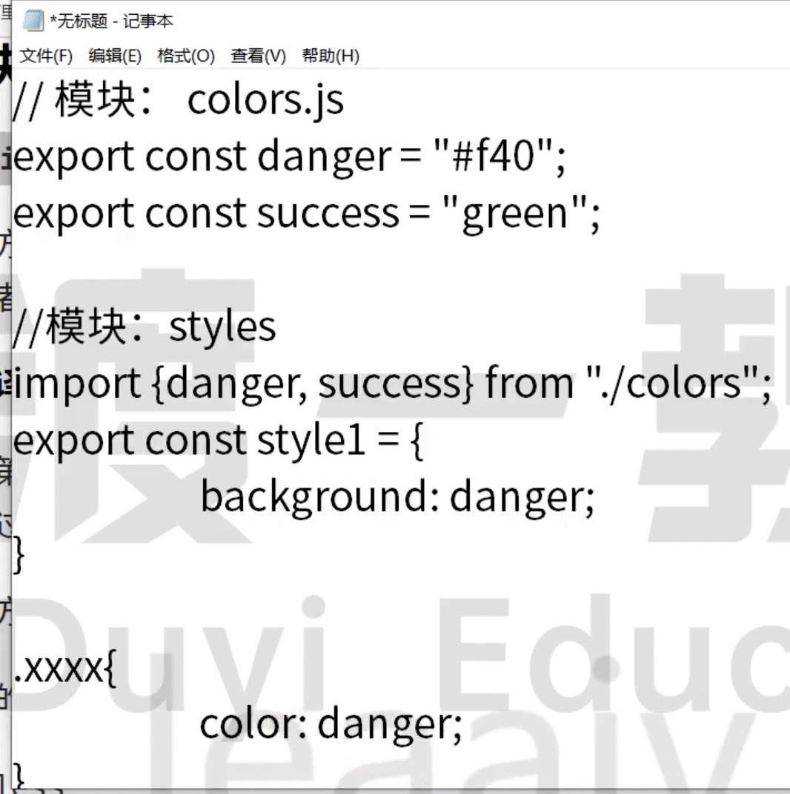

# 28 预处理器

css in js 也可以解决样式重复的问题：



2023 年还可以使用 CSS 变量：

```css
:root {
  --color-danger: red;
}

.btn {
  background-color: var(--color-danger);
}
```

还有 CSS 预编译器：

## 基本原理

编写 css 的时候，css 语言本身笔记弱，难以处理的问题：

1、重复的样式值

2、重复的代码段

3、重复的嵌套书写

```less
.a .b .box {
}
// 转换为
.a {
  .b {
    .box {
    }
  }
}
```

因为 css 不解决，所以第三方机构来解决

预编预器的原理很简单，使用一种更加优雅的方式书写 css 代码，通过编译器，将代码转换为可以被浏览器识别的 css 代码

<!-- 图片 -->

目前主流的就是 less 和 sass，sass 先出现。

## less 的安装和使用

1、安装

2、使用 less 的 CLI

```bash
$ npx lessc less文件 编译后的文件
$ npx lessc ./src/style/index.less ./dist/index.css
```