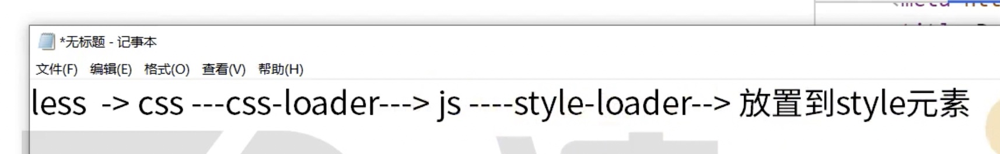

# 29 Webpack 使用 less

```js
module.exports = {
  module: {
    rules: [
      {
        test: /\.jpeg$/,
        use: ["file-loader"]
      },
      {
        // 匹配 less 文件
        test: /\.less$/,
        use: ["style-loader", "css-loader", "less-loader"]
      }
    ]
  }
};
```

执行 npx webpack 发现 <head></head> 内新增 css 代码

需要先使用 less-loader 把 less 语法转换为 css 代码，然后 style-loader 把代码添加到 HTML 文件中



安装

```bash
npm i less-loader less -D
```

less-loader 需要使用 less 的核心库，所以需要安装 less
