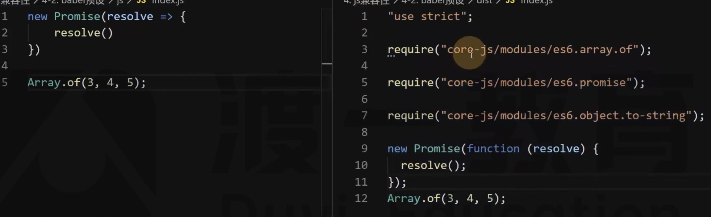

# 34 Babel 预设

预设就是集合了很多常用的插件，不再需要一个一个插件的进行安装配置。

1、安装

```bash
$ npm i -D @babel/preset-env
```

2、配置

```json
{
  "presets": ["@babel/preset-env"]
}
```

3、兼容浏览器版本

预设需要根据浏览器的范围来确认如何进行编译，可以使用 .browserslistrc 文件来配置，也可以在 package.json 文件中配置（存在默认值）。

```text
last 3 versions
```

4、自身的配置

```json
{
  "presets": [["@babel/preset-env", { "useBuiltIns": "usage" }]]
}
```

默认只会转换语法，不会转换 API

useBuiltIns 用来配置新的 API，然后按需注入到代码里。

core-js 里面包含新 API 的具体实现。



还需要安装 core-js:

```bash
npm i -S core-js
```

```json
{
  "presets": [
    ["@babel/preset-env", { "useBuiltIns": "usage", "corejs": 3 }]
  ]
}
```

因为编写的时候使用的是 core 是 2，所以需要手动指定版本

然后就可以大胆的使用一些新的语法和 API 函数。