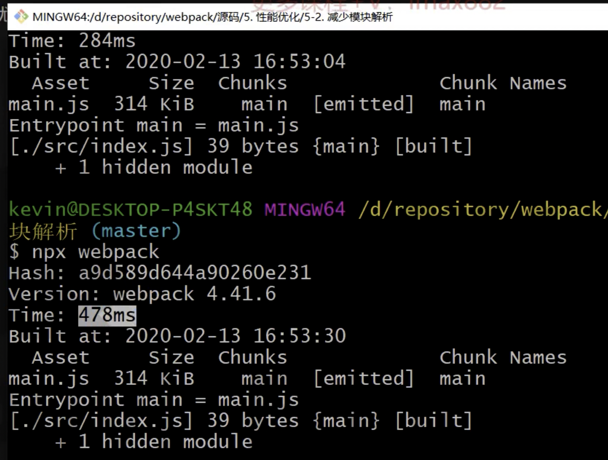
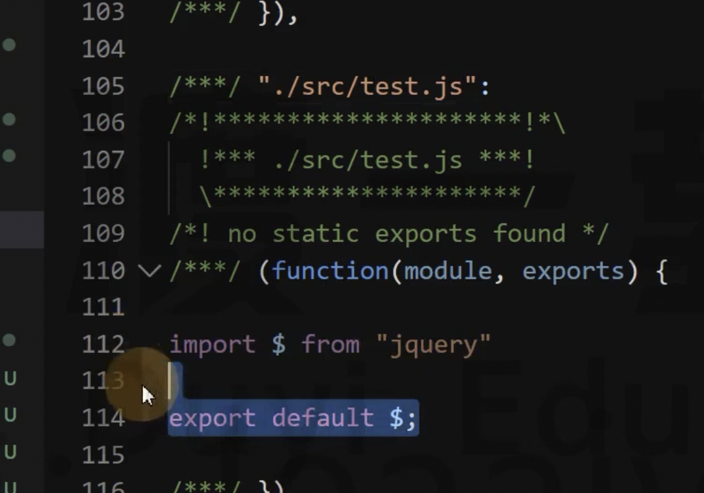

# 38 减少模块解析

- 回顾 Webpack 的编译过程。什么是模块解析？模块解析的过程：抽象语法、依赖分析、模块语法转换

- 不解析会怎么样？可以缩短构建时间！

- 哪些模块不需要进行解析？模块中无其他依赖（一句打包好的第三方模块，例如 jquery 已经被打包完成，我们在就不需要再对 jquery 进行解析了）

```js
// src/index.js
import $ from "$";
console.log($);
```

```js
module.exports = {
  mode: "development",
  module: {
    noParse: /jquery/
  }
};
```

然后会形成打包结果，只是不参与模块解析了，提高了构建的效率



不能进行滥用，例如自己实现一个模块

```js
// node_modules/test.js
import $ from "jquery";
console.log($);
```

```js
module.exports = {
  mode: "development",
  module: {
    // noParse: /jquery/
    noParse: /test/ // 配置不对 test 模块进行解析
  }
};
```

打包结果，src/index.js 代码会被转换，但是会把 test 模块原封不动的产出，import 语法不会进行转换，且没有 jquery 的代码！！！



所以，必须是没有依赖的模块、并且不需要进行模块解析的才可以进行排除！