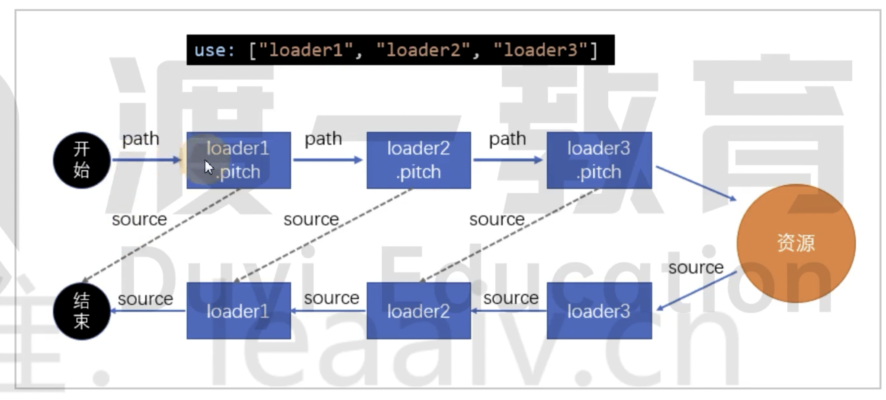

# 39 优化 Loader 的功能

## 进一步限制 Loader 的应用范围

例如 babel-loader 转换 ES6 的语法，有一些库本身就把代码进行转换了，我们就没有必要进行转换了！

例如 lodash

使用 module.rule.exclude 进行排除，或者使用 module.rule.include 进行包含

```js
module.exports = {
  module: {
    rule: [
      {
        test: /.js$/,
        exclude: /lodash/,
        use: "babel-loader"
      }
    ]
  }
};
```

暴力一点就是直接把 node_modules 下全部进行排除：

```js
module.exports = {
  module: {
    rule: [
      {
        test: /.js$/,
        exclude: /node_modules/,
        use: "babel-loader"
      }
    ]
  }
};
```

> 打包对比图

和 module.noParse 不冲突，可以并行使用

## 缓存 Loader 的结果

如果某个文件的内容不变，那么解析的结果也不会改变。如此，我们就可以把第一次编译的结果进行缓存，后续就不再进行编译。

使用 cache-loader 进行缓存

```bash
$ npm i cache-loader -D
```

```js
module.exports = {
  module: {
    rule: [
      {
        test: /.js$/,
        use: ["cache-loader", "babel-loader"]
      }
    ]
  }
};
```

cache-loader 明明是放在数组第一项的，如何控制 babel-loader 不执行呢？

Loader 执行过程还有一个过程：

```js
function LoaderTest(sourceCode) {}
// 设置一个 pitch 属性，是一个函数
LoaderTest.pitch = function (filepath) {
  // 可返还内容或者不返回
  // 如果返回，源代码
};

module.exports = LoaderTest;
```



前面学习 Loader 执行过程的时候，是先执行 Loader3、Loader2、最后是 Loader1

实际上前面还有个过程，例如 src/index.js 文件，会把文件路径交给 Loader1.pitch 函数运行，如果 Loader1.pitch 执行完成没有返回结果，那么继续把路径交给 Loader2.pitch 进行处理，以此类推，直到最后读取资源，开始 Loader3、2、1 这样的流程

pitch 可以通过是否返回控制下一步到哪里，例如 Loader1.pitch 返回了内容，那么就直接结束了，如果 Loader2.pitch 发挥了内容，那么就会交给 Loader1 进行处理。

所以，cāche-loader 放在数组第一项，是为了让 Loader1.pitch 直接返回，这样就不会执行 babel-loader 了

内部就是看一下是否具有缓存，存在缓存就返回内容，否则不返回继续执行 Loader2.pitch

## 为 Loader 运行开启多线程

thread-loader 会开启一个多线程，线程池中包含适量的线程

例如有 10 个 JS 文件需要解析，过程会比较慢，因为要依次进行解析，利用多线程进行并行处理。

```bash
$ npm i thread-loader -D
```

```js
module.exports = {
  module: {
    rule: [
      {
        test: /.js$/,
        // "thread-loader" 后续的 Loader 会放到线程池中运行
        use: ["cache-loader", "thread-loader", "babel-loader"]
      }
    ]
  }
};
```

thread-loader 存在一些限制：

- 无法使用 Webpack API 生成文件

- 无法使用自定义的 Plugin API

- 无法访问 Webpack options

所以后面只能是一些纯粹的转换代码的功能，不依赖 Webpack 功能的 Loader