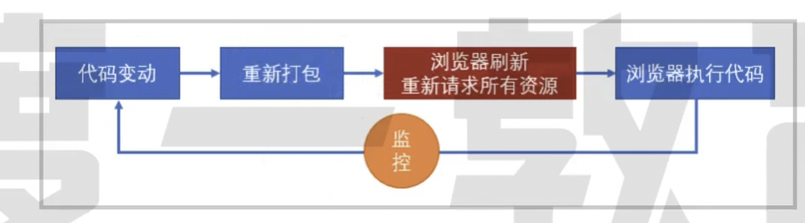
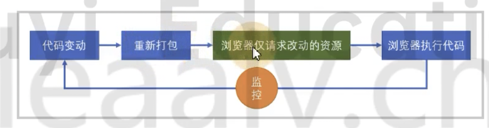

# 40 热模块替换

> 热模块替换并不能降低构建时间，但是可以降低代码改动到效果呈现的时间

使用 webpack-dev-server 的时候过程：



浏览器虽然请求的是本地的文件，但是依然是需要耗费时间的，热模块优化的加载文件的流程。

我们希望更改代码后，浏览器能不能不要刷新，但是效果又是最新的，这就热更新。

Hot Module Repalce

流程更改为：



浏览器由于没有刷新，资源就不会重新请求，页面也不会刷新！

## 使用

```js
module.exports = {
  devServer: {
    // 开启 HMR
    hot: true
  },
  plugins: [
    // 可选，Webpack4 的时候， hot: true 已经默认开启了该插件
    new webpack.HotModuleReplacementPlugin()
  ]
};
```

```js
// src/index.js

console.log(3);

if (module.hot) {
  module.hot.accept();
}
```

页面效果，文本框内容还在，页面没有进行刷新。

## 热模块更新的原理

```js
// src/index.js

console.log(3);

if (module.hot) {
  module.hot.accept();
}
```

这段代码最终是参与运行的。

module 是在 Webpack 打包后，Webpack 实现的模块化中传递的

```js
function(module, exports, require){
    // src/index.js 内容
}
```

当开启了 webpack-dev-serve 后回向打包结果中注入 module.hot 属性

默认情况下，devServer 不管你是否配置了 hot: true 重新打包都会刷新页面，但是如果执行了 module.hot.accept() 就会阻止刷新。

module.hot.accept() 会让 devServer 通过 websocket 管道，把服务器更新的内容发送到浏览器

然后吧结果交给 HotModuleReplacementPlugin 插件注入代码执行，HotModuleReplacementPlugin 插件会根据覆盖原始代码，然后让代码重新执行。

所以，热模块替换发生在代码运行期间。

简单理解就是，服务器告诉浏览器哪块更新了，应用更新，把代码重新运行，完成更新。

## 样式热模块

样式热模块替换需要使用 style-loader

因为热模块替换的时候，HotModuleReplacementPlugin 只会简单的运行模块代码，所以 style-loader 代码运行后，样式也就更新了

mini-css-extract-plugin 插件，把样式提取到单独的文件中，生成文件是在构建期间完成的，运行期间无法更改文件，所以它无法使用热模块更新。
