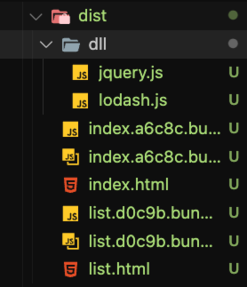

# 41 手动分包

传输性能，就是打包出来的文件体积经可能的小，另外就是把不会频繁变动的文件打包到一起，充分利用浏览器的缓存。

什么是分包？

就是讲一个整体的代码，分不到不同的打包文件中去。

```js
import $ from "jquery";
import _ from "lodash";

// 判断是不是一个数组
const result = _.isArray($(".red"));
console.log(result);
```

把所有的依赖代码都合并到一个 bundle 中去，这样就会导致文件体积过大，影响性能（相见 dist/main.js）。

假如，现在有一个 list.js 文件也需要加载依赖 jquery 和 lodash 模块，那么就会导致模块重复打包！

两个 bundle 文件都包含 jquery 和 lodash 的代码，虽然不会影响打包结果，不影响运行的结果，但是影响了打包的体积。

希望公共的代码单独的打包出来，充分利用浏览器的缓存。

为什么需要分包？

- 减小公共代码，降低总体积

- 充分利用浏览器的缓存

什么时候需要分包？

- 多个 chunk 引用了相同的模块

- 公用模块体积比较大，基本不会进行改动

如何分包？

- 手动分包

- 自动分包

## 手动分包

基本思路：

### 1、先单独对公共模块进行打包

把 jquery 和 lodash 单独进行打包，暴露出来一个变量

dll：dynamic link library 动态连接库，基本概念就是生成一个文件，文件暴露 API，API 可以拿出来用

详见 webpack.dll.config.js 文件

- 配置文件内容进行打包

- 生成 dist/dll 下面的文件

- 使用 webpack.DllPlugin 插件生成资源清单文件，打包运行

```json
{
  // 暴露的变量名
  "name": "jquery",
  "content": {
    // 模块的路径（ID）
    "./node_modules/jquery/dist/jquery.js": {
      "id": 1,
      "buildMeta": { "providedExports": true }
    }
  }
}
```

到这里完成公共模块的打包

### 2、根据入口模块进行正常打包 📦

源代码不变

```js
// src/index.js

import $ from "jquery";
import _ from "lodash";

// 判断是不是一个数组
const result = _.isArray($(".red"));
console.log(result);
```

需要在页面中手动导入公共模块

```html
<script src="./dll/jquery.js"></script>
<script src="./dll/lodash.js"></script>
```

还需要重新配置 clean-webpack-plugin，否则会把之前打包的公共模块全部清除

```js
new CleanWebpackPlugin({
  cleanOnceBeforeBuildPatterns: ["**/*", "!dll", "!dll/*"]
});
```

npm run build:dell

npm run build



可以看到 dist/dell 下面的内容依然是存在的

这个时候 dist/index.js 和 dist/list.js 里面依然是含有 jquery、lodash 代码的

然后使用 webpack.DllReferencePlugin 进行配置，让 Webpack 打包的时候检查资源清单

如果打包的时候源代码匹配到了资源清单里面的内容，就会直接引用资源清单里面的内容，而不是打包源代码

npm run build

```js
/******/ ({

/***/ "./node_modules/jquery/dist/jquery.js":
/*!********************************************************************************!*\
  !*** delegated ./node_modules/jquery/dist/jquery.js from dll-reference jquery ***!
  \********************************************************************************/
/*! no static exports found */
/***/ (function(module, exports, __webpack_require__) {

module.exports = (__webpack_require__(/*! dll-reference jquery */ "dll-reference jquery"))(1);

/***/ }),
```

这个时候 jquery 代码就会进行打包了，而是通过 "dll-reference jquery" 进行直接导出，页面上必须手动导入 script

## 总结

- 开启 output.library 暴露公共模块

- 开启 DllPlugin 创建资源清单

- 使用 DllReferencePlugin 引用资源清单

注意点：

- 资源清单不参与源码的执行

- 公共模块必须手动导入在页面中

- 不要对小型的公共库进行使用

优点：

- 

缺点：

-  

A

B

进行单独打包，A=》C=》D=》F，这样打包后，A 就包含 CDF 的代码

B=》D=》F，这样打包后，B 就包含 DF 的代码，这样手动打包就很麻烦了，还需要单独对 D 进行打包