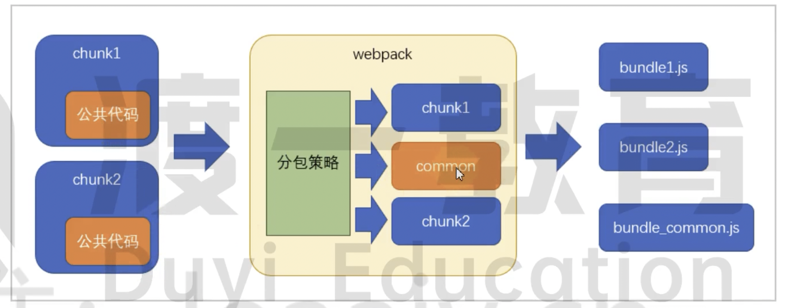
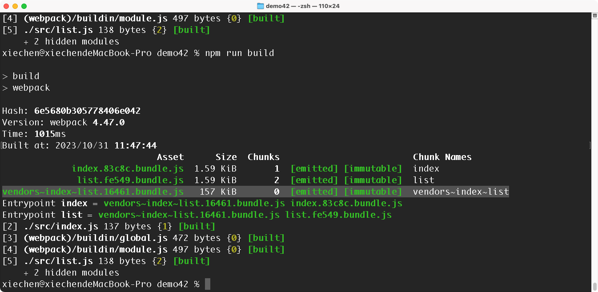
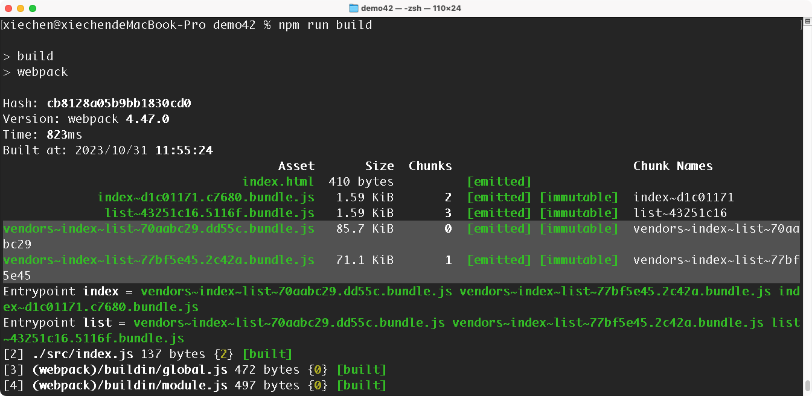
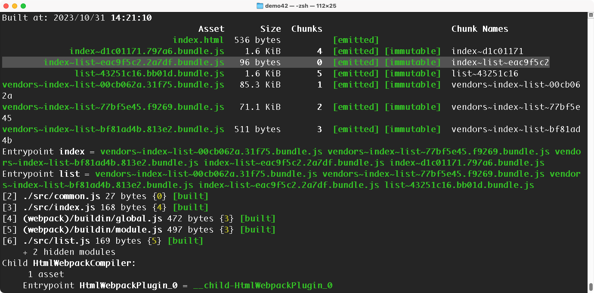
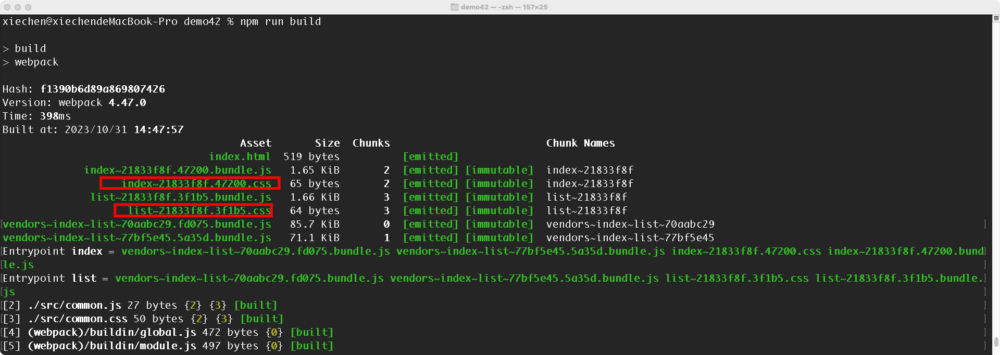
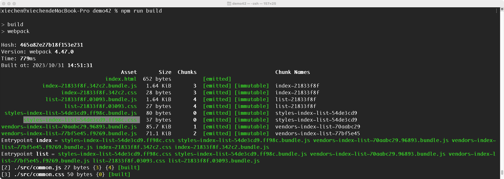
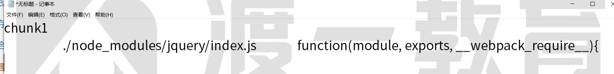
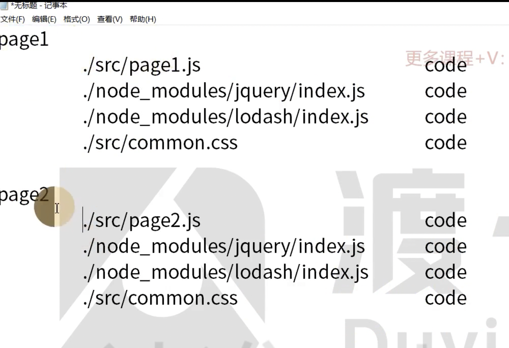

# 42 自动分包

是性能优化最常见的方案！

相对于手动分包的缺点：

- 手动分包可以极大提高构建速度，自动分包构建速度会变慢

- 自动分包开发效率会比较高

## 基本原理

从实际角度出发（提取公共代码），从宏观的角度进行控制分包，而不是对具体的哪个包分出去进行控制。

控制分包，关键要配置一个合理的分包策略。

> Webpack 内部使用的是 splitChunksPlugin 进行分包的。



## 基本配置

```js
module.exports = {
  // ...其他配置
  optimization: {
    splitChunks: {}
  }
};
```

分包策略有其默认的配置，为什么没有效果呢？

1、chunks 配置项

用于配置哪些需要使用分包策略的 chunks

- all 所有的 chunk 都是用

- async 默认，针对异步 chunk 进行分包

- initial 针对普通的 chunk 进行分包

```js
module.exports = {
  optimization: {
    // 分包配置
    splitChunks: {
      chunks: "all"
    }
  }
};
```



发现公共代码进行提取，命名为 vendors~index~list，vendors 就是在 node_modules 下的第三方库

2、maxSize

控制包最的字节数

目前分包的结果还是很大，有 157kb

控制某个包如果超过了指定的「字节」，那么 Webpack 会使用最大的努力对这个包再进行分包

```js
module.exports = {
  // 优化项
  optimization: {
    // 分包配置
    splitChunks: {
      chunks: "all",
      maxSize: 100 * 1024
    }
  }
};
```



有的时候会看到，我明明设置了最大为 100kb，但是分包的结果还是很大，这是为什么呢？

分包的时候基础单位是模块，如果一个完整的模块超过了设置的体积，它是无法再分包的，所以会出现超过指定大小的情况！

意义不大，因为总体积没变，但是有的浏览器可以多线程并行下载

如果要减少公共模块的体积，要进行压缩和 Tree Shanking

## 其他配置

1、automaticNameDelimiter: 新 chunk 名称的分隔符

```js
module.exports = {
  optimization: {
    // 分包配置
    splitChunks: {
      chunks: "all",
      maxSize: 102400,
      automaticNameDelimiter: "+" // 更改链接字符
    }
  }
};
```

结果：vendors+index+list+70aabc29.102b8.bundle.js

2、minChunks: 一个模块被多少个 chunk （chunk 而不是模块）使用的时候才会进行分包。默认 1

```js
module.exports = {
  entry: {
    index: "./src/index.js",
    list: "./src/list.js"
  }
};
```

对于这个案例来说，不管 index （chunk）内部有多少内模块构成，只要某一个模块使用了 1 次 jquery，那么 jqury 就会被分包。

例如，我们新建一个 common 文件，进行打包，发现没有效果，这是因为另外一个属性没有生效。

3、minSize: 模块达到多少字节后才会被分包，默认 30kb

```js
module.exports = {
  optimization: {
    splitChunks: {
      chunks: "all",
      maxSize: 102400,
      // automaticNameDelimiter: "+"
      minChunks: 1,
      minSize: 10
    }
  }
};
```



## 缓存组

上面的分包策略都是全局的

实际上，分包策略是基于缓存组的。每个缓存组提供一套独有的策略，Webpack 按照缓存组的优先级依次处理每个缓存组，被处理过的缓存组就会再次被分包了。

默认，webpack 具有两个缓存组：

```js
module.exports = {
  optimization: {
    splitChunks: {
      cacheGroups: {
        chunks: "all",
        maxSize: 102400,
        // 属性名称就是缓存组的名称，会影响分包的名称
        // 属性值就是缓存组的配置，缓存组继承所有的全局配置，也有自己特殊的配置
        vendors: {
          // 凡是全局配置的条件+正则匹配的时候，就会进行改组的分包
          test: /[\\/]node_modules[\\/]/,
          // 缓存组优先级，优先级越高，该策略就会优先处理，默认值为 0
          priority: 0
        },
        // default 缓存组的优先级低一些，
        default: {
          // 覆盖了全局的 minChunks 属性，chunk 最小被使用次数为 2
          minChunks: 2,
          // 优先级
          priority: -20,
          // 已经被分包出去 chunk 就不要再重新分离，防止分离相同的 chunk
          reuseExistingChunk: true
        }
      }
    }
  }
};
```

案例，新增 common.css\index.css\list.css，然后分别在 index.js 和 list.js 文件中进行导入，并进行打包，结果如下：



可以看到只生成了两个 css 文件，common.css 并没被处理出来！

```js
module.exports = {
  // 优化项
  optimization: {
    // 分包配置
    splitChunks: {
      chunks: "all",
      maxSize: 102400,
      cacheGroups: {
        // 新增一个针对公用 CSS 的缓存组
        styles: {
          minSize: 0,
          test: /\.css/,
          minChunks: 2
        }
        // 删除默认的 cacheGroup 配置
      }
    }
  }
};
```



但是多处一个 JS 文件，commonJS 是有可能开启 CSS Module 对象的，这个 JS 文件就是为了满足 CSS Module 的

## 配合多页应用

目前单页面应用是主流，但是还是会遇到多页面的情况

```js
module.exports = {
  plugins: [
    new HtmlWebpackPlugin({
      template: "./public/index.html"
    })
  ]
};
```

默认的模版会把所有的 chunk 内容全部加载进来，所我们就需要配置 HtmlWebpackPlugin.chunks 属性，但是 chunk 是经过分包的动态，我们还需要手动一个一个填写要分包的 chunk，比较麻烦。

```js
module.exports = {
  plugins: [
    new HtmlWebpackPlugin({
      template: "./public/index.html",
      chunks: ["index"]
    })
  ]
};
```

最新版的 HtmlWebpackPlugin 插件，会自动把 index 相关的 chunk 全部加载到 index.html 文件中

## 原理

- 检查每个 chunk 的编译结果

- 根据分包策略，找到满足条件的 chunk





- 找到满足策略的 chunk 那么就会确认为目标 chunk，然后新建一个 chunk，例如 vendors~page1~page2 然后把 chunks 中的模块添加到这个新 chunk 中，

- 并且从之前的 chunk 中删除