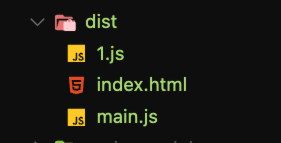
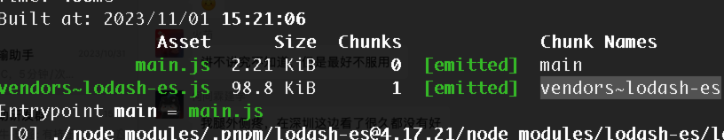

# 45 懒加载

页面一开始加载的时候不需要加载那么多的 JS，可以先加载一部分，然后等用户需要的时候再加载，这样能大大减少页面加载时间，提升用户体验。

```js
import { chunk } from "lodash-es";

const btn = document.getElementById("btn");
btn.onclick = function () {
  const result = chunk([1, 2, 3, 4, 5, 6, 7, 8, 9, 10], 2);
  console.log(result);
};
```

实现一个点击按钮加载

这个时候进行打包是没有效果的。

必须使用 import() 而不是 require()

import() 是 ES6 的草案，不是正规的标准，但是 Webpack 是认可的，认为这是动态加载，一开始可以是不存在的，认为是 index 的依赖，但是认为不需要打包到 index 模块中去

会造成浏览器 JSONP 的方式远程读取 JS 模块，打包为一个单独的 JS 文件

import() 返回一个 Promise



w 为什么是 1.js ？

因为异步加载的代码没有 chunk names，可以通过注释的方式写一个 chunk name

```js
const btn = document.getElementById("btn");
btn.onclick = async function () {
  const _ = await import(/* webpackChunkName: "lodash-es" */ "lodash-es");
  const result = _.chunk([1, 2, 3, 4, 5, 6, 7, 8, 9, 10], 2);
  console.log(result);
};
```



和我们开始学习分包的时候基本类似

会丢失 tree shaking，因为没有静态的依赖，导致无法进行分析

```js
// util.js

// 使用静态的方式把 chunk 导出
export { chunk } from "lodash-es";
```

```js
// src/index.js
const { chunk } = import("./utils.js");
```

这样就可以完成 tree shaking 了，但是不是笔记好的方案，但是没有办法！