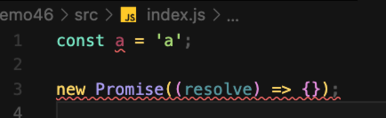

# 46 ESLint

代码风格检查

团队开发代码，一人一个样子，会产生冲突，所以需要进行统一。

不会影响代码的执行，只会检查代码的书写风格。

和 Webpack 关系不大，不满足风格要求就会提示报错。

## 使用

- 配合编辑器进行使用

如果配合构建工具使用，是能在构建的时候才会提示，而编辑器会在错误时候立马提示，例如 VSCode 编辑器

检查工作还是会交给 ESLint 来完成，所以需要进行局部或者全局安装

另外检查的时候依赖 ESLint 的配置文件 .eslintrc

开发依赖和生产依赖什么时候才会有意义呢？

你的包发不出去给别人使用的时候才有意义。

```bash
$ npm i eslint
$ npx eslint --init
```



编辑器中虽然飘红，但是不影响代码的运行，只是提示风格错误！

### parser

工作原理就是先把代码进行解析，然后按照规则进行分析。

ESLint 解析的时候到底用什么解析器来解析呢？例如对 React、TypeScript

需要可以配置自定义的解析器，默认 Espree

### globals

配置全局变量

否则代码中使用全局变量会飘红

ESlint 还可以通过注释的方式来进行配置，某些 JS 的代码比较特殊又不想改动整体的配置：

```js
/* global var1,var2:writable */
console.log(var1);
console.log(var1);
```

这样就可以通过检查

### extends

继承一些已经配置好的规则，不需要自己手动一个一个的进行配置

### rules

规则集
