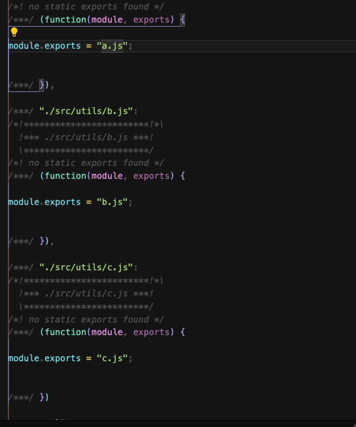
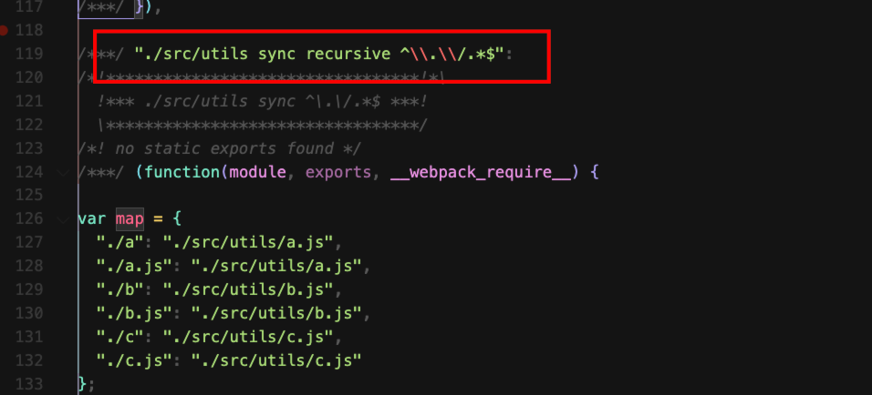

# 49 不确定的动态依赖

某些情况依赖关系是这样的

```js
if (Math.random()) {
  // 动态依赖
  const a = require("./utils/a");
  console.log(a);
}
```

只有运行代码的时候才能确定依赖关系，不运行是无法确定的，面对动态依赖 Webpack 会直接进行打包进来。

什么是不确定的动态依赖呢？

```js
const module = document.getElementById("#txt").value;
if (Math.random()) {
  const a = require("./utils/" + module);
  console.log(a);
}
```

Webpack 依然无法进行依赖分析，因为这是用户动态输入的，也就是不确定的动态依赖。

怎么办？



Webpack 会把 utils 所有的模块都进行导入。没有办法，不敢不导入，如果不导入会导致模块的缺少。

而且生成这么一个对象：

```js
var map = {
  "./a": "./src/utils/a.js",
  "./a.js": "./src/utils/a.js",
  "./b": "./src/utils/b.js",
  "./b.js": "./src/utils/b.js",
  "./c": "./src/utils/c.js",
  "./c.js": "./src/utils/c.js"
};
```

面对这种不确定的动态依赖，我们要手动的确定依赖大致的位置

动态加载的本质：

```js
// require("./utils/" + module); =>>
require.context("./utils/");
```

所以，上面的写法会进行转换，**仅在 Webpack 运行过程中有效**，让 Webpack 把目录下的模块全部进行打包。

require.context() 的参数：

- String，表示哪个目录的模块要添加到打包结果中

- Boolean，是否要递归寻找子目录，如果为 true 表示需要寻找子目录

- Regexp，表示要匹配的文件的正则表达式，如果不写表示加载全部的文件，否则只会加载匹配的文件



该函数执行后会继续生成一个模块 `"./src/utils sync recursive ^\\.\\/.*$":`

该模块内记录了所有可能用到的模块:

```js
const module = {
  "./src/utils sync recursive ^\\.\\/.*$": function (
    module,
    exports,
    __webpack_require__
  ) {
    var map = {
      "./a": "./src/utils/a.js",
      "./a.js": "./src/utils/a.js",
      "./b": "./src/utils/b.js",
      "./b.js": "./src/utils/b.js",
      "./c": "./src/utils/c.js",
      "./c.js": "./src/utils/c.js"
    };

    function webpackContext(req) {
      var id = webpackContextResolve(req);
      return __webpack_require__(id);
    }

    function webpackContextResolve(req) {
      if (!__webpack_require__.o(map, req)) {
        var e = new Error("Cannot find module '" + req + "'");
        e.code = "MODULE_NOT_FOUND";
        throw e;
      }
      return map[req];
    }

    webpackContext.keys = function webpackContextKeys() {
      return Object.keys(map);
    };
    webpackContext.resolve = webpackContextResolve;
    module.exports = webpackContext;
    webpackContext.id = "./src/utils sync recursive ^\\.\\/.*$";
  }
};
```

最后返回一个 `webpackContext` 函数，该函数会以 utils 目录为基准，然后使用目录下的模块

```js
const context = require.context("./utils");
const a = context("./a.js");
console.log(a);
```

总结

require.context("./utils/"); 生产一个上下文，上下文中的模块都会形成打包结果，我们可以通过返回的函数，找具体的模块

而且 context.keys() 返回的是数组，表示找到的所有的模块

```js
console.log(context.keys());
```

说了半天，这个玩意到底有啥用处呢？

除了我们不确定的时候，帮我们自动完成

有的时候我们可以使用 require.context() 做一些事情：

uilts 下有很多的模块，分散很多的模块，但是我用的时候是希望整体使用的，

```js
export.a = require("./a")
export.b = require("./b")
export.c = require("./c")
```

这样写好像也没有什么问题，但是如果某天模块的名称改了、文件的位置改了，我们也需要进行维护

这个时候我们就可以粗暴一点，直接把所有的模块都进行打包：

```js
const result = require.context("./utils", true, /\.js/);
console.log(result.keys());
// [ './a.js', './b.js', './c.js' ]
```

优化：

```js
const context = require.context("./utils", true, /\.js/);
console.log(context.keys());

for (const key of context.keys()) {
  let filename = key.substr(2);
  filename = filename.substr(0, filename.length - 3);
  module.exports[filename] = context(key);
}
```

这样就可以动态的所有的模块都导入进来了。

所有，以后我们在 Webpack 的工程中如果遇到一个目录下的文件都是为一个功能服务的，只是认为的拆分开，我们需要在一个地方把所有的模块都导入，我们局可以使用这个函数。