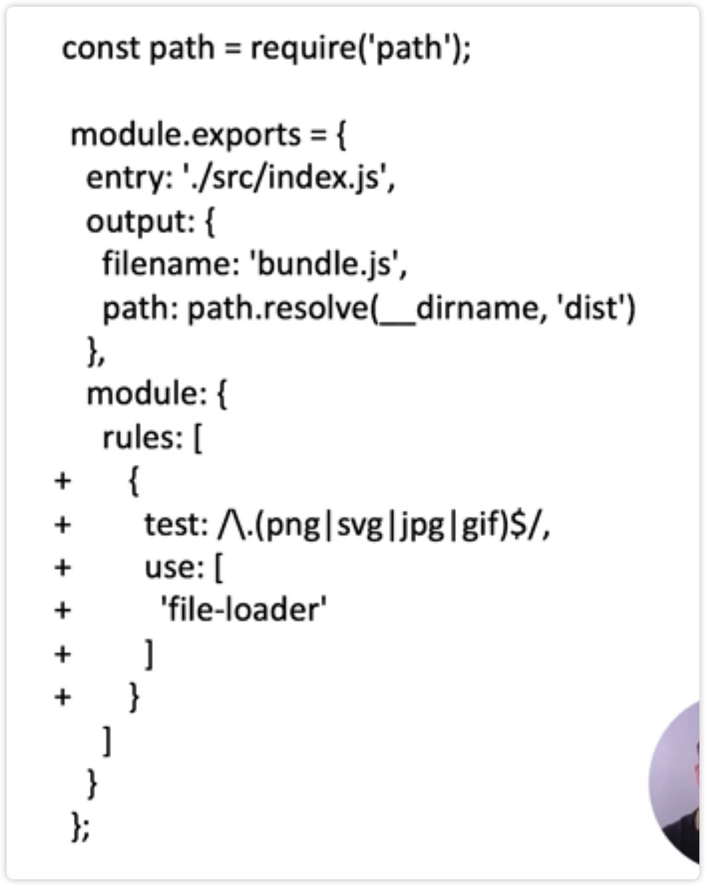
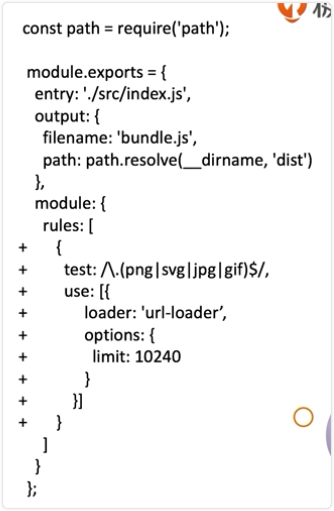
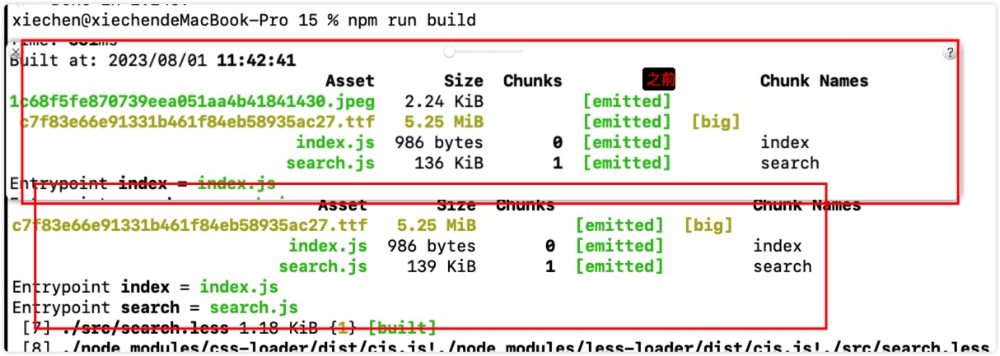

# 解析图片和字体

webpack 如何解析图片和字体文件？

使用 file-loader

1、导入图片文件

2、修改源代码

3、配置文件

4、编译运行

编译结果，图片被复制到 dist 目录，文件名为 hash 值

webpack 解析图片和字体的做法是一样的，因为图片和字体都不是代码文件，图片和字体都可以使用 file-loader 进行解析

1、下载一个字体文件

2、less 文件导入，且使用

3、配置 webpack

4、打包运行

图片解析和字体解析有其他方式吗？

url-loader 和 file-loader 功能差不多，也可以处理图片和字体

只不过 url-loader 功能更加强大，可以设置资源的大小，资源小于指定大小时，会自动转换成 base64 格式

url-loader 内部也是使用 file-loader 进行解析的

url-loader 接受一个参数，通过 options 进行传递

limit 的单位是字节

