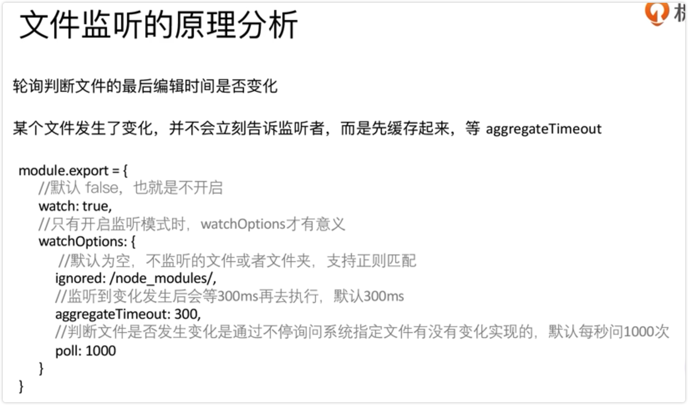

# Webpack 中的文件监听、

我们开发的时候编写玩代码后希望能马上看到结果，但是现在需要每次都手动进行编译。

所以 Webpack 进行自动编译时非常有必要的。

文件监听的作用就是发现源代码发生变化后后，自动重新构建出出新的输出文件。

开启文件监听有两种方式：

虽然能自动构建，但是每次都需要手动刷新浏览器。

1、配置 package.json

2、运行 npm run watch

3、修改源文件后自动进行编译

## 文件监听原理分析

