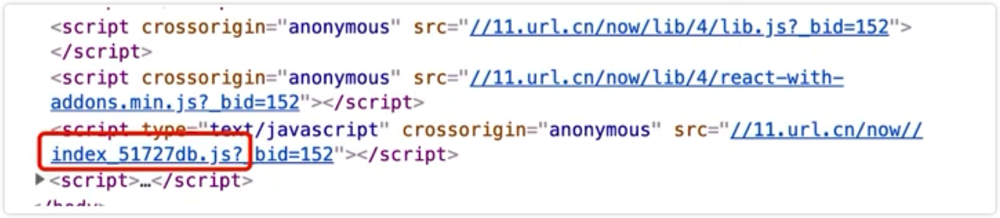
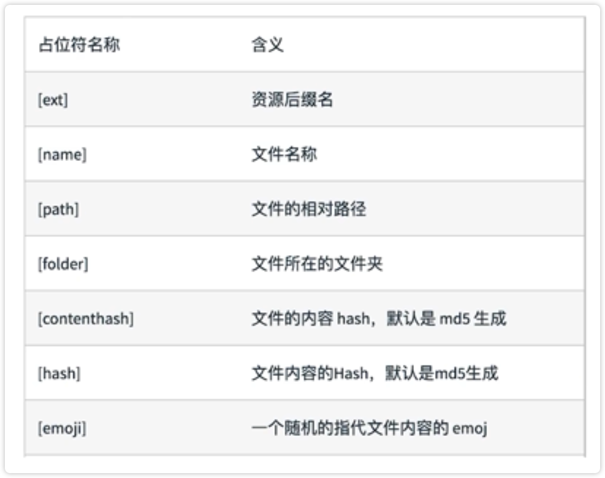

# 文件指纹策略：chunkhash、contenthash和hash

什么是文件指纹？

目前网站 JS 文件通常都会有一个后缀，这个后缀就是文件指纹。

文件指纹的好处：

1、版本的管理，项目发布的时候，有的文件被修改，有的则没有，我们只需要发布修改的文件即可。

2、缓存，如果文件没有变化，浏览器会使用缓存，如果文件有变化，浏览器会重新请求服务器。

## 文件指纹如何生成？

chunk 一般指的就是我们引入的模块。

chunkhash 就是根据模块内容生成的一个 hash 值，这个值是唯一的，只要文件内容没有变化，hash 值就不会变化。

1、使用 chunkhash 作为文件指纹

2、使用 contenthash 作为文件指纹

对于 css 文件，一般使用 style-loader 和 css-loader 的时候，css 会被 style-loader 动态的添加到 html 的 head 中去，这个时候并没有独立的 css 文件。

我们可以使用 MiniCssExtractPlugin 插件，将 css 文件单独提取出来。所以，css 文件一般使用 contenthash 作为文件指纹。

3、使用 hash 作为文件指纹

设置 file-loader 的 name，使用 [hash]

1、把 webpack.config.js 文件拆分为生产和测试

2、更改 package.json 文件的 build 和 dev 命令

3、更改 webpack.prod.js 文件

4、安装 MiniCssExtractPlugin 插件

5、配置这个插件

6、修改对 css 文件处理的 loader，因为 MiniCssExtractPlugin.loader 和 style-loader 是互斥的