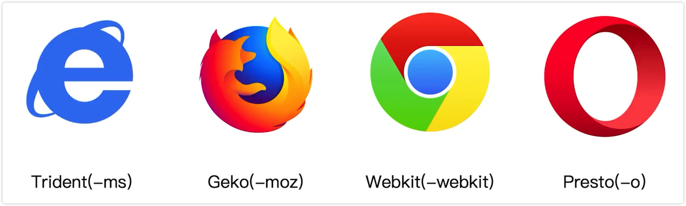

# PostCSS 插件 autoprefixer 自动补齐 CSS3 前缀

由于浏览器的标准并没有统一，所以需要加上不同的前缀，如果手动加上前缀，那工作量就太大了，所以需要一个工具来自动补齐前缀。

CSS3 的属性在不同的浏览器上需要加上不同的前缀，比如 `border-radius` 需要加上 `-webkit-` 前缀，`box-shadow

针对不同的浏览器内核需要加上不通的前缀。

可以使用 autoprefixer 插件自动补齐 CSS3 前缀。

和 less、sass 不同，它们是 CSS 的预处理器。

预处理器是打包前去处理

autoprefixer 是后置处理器，在样式处理好后再进行处理

这个插件也是和 postcss-loader 配合使用的。

1、安装 postcss-loader 和 autoprefixer 插件

2、更改配置文件

3、进行编译

