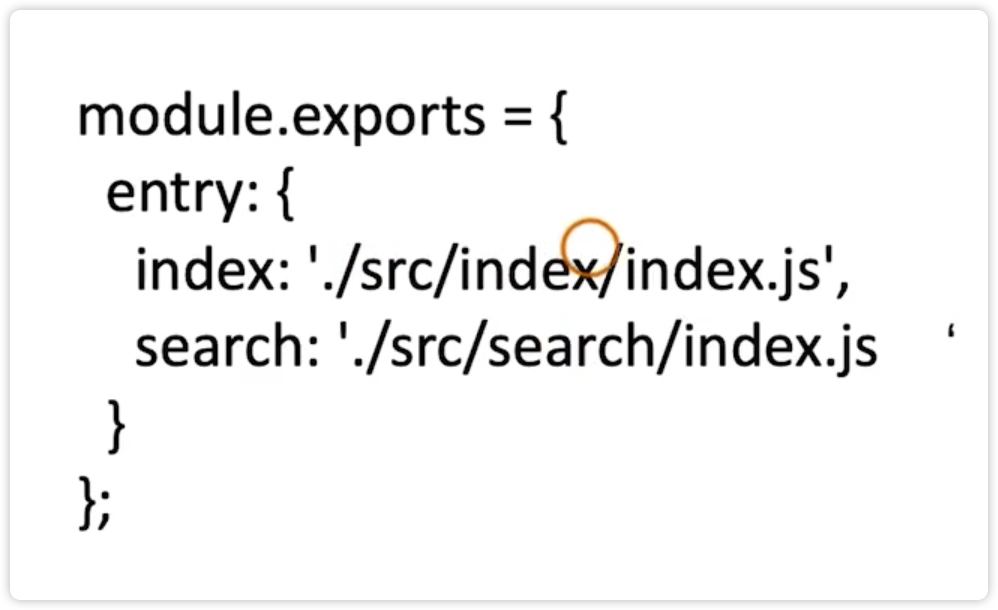

# 多页面应用打包通用方案

多页面应用和单页面应用最直接的区别就是，多页面是很多入口，一个页面就是一个文件

单页面通常所有业务都放到一个入口中去，通过 hash 来实现路由的跳转

多页面的优点：页面之间是解耦的，SEO 更友好。

如何实现多页面应用？

每个页面都对应一个 entry，一个 html-webpack-plugin

缺点：每次新增、删除一个页面的时候都需要更改 webpack 的配置

如何更加优雅的动态生成 entry 和 html-webpack-plugin？

利用 glob.sync 遍历文件，动态生成 entry 和 html-webpack-plugin

我们做出一个约定：

所有的页面都放在 src 的目录下，每个页面的入口都为 index.js 文件

这样就可以获取 src 下所有的目录，然后就知道入口文件的数量来，最后动态的设置 html-webpack-plugin

1、新建目录，移动文件

2、修改 search.html 为 index.html

3、安装 glob 

4、在 webpack.prod.js 编写构建代码

5、
