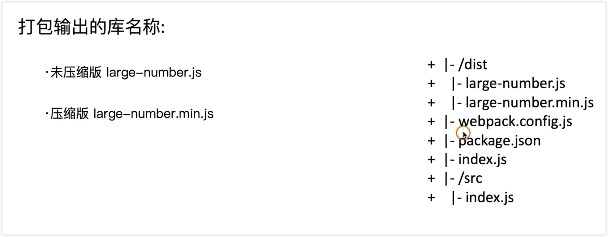
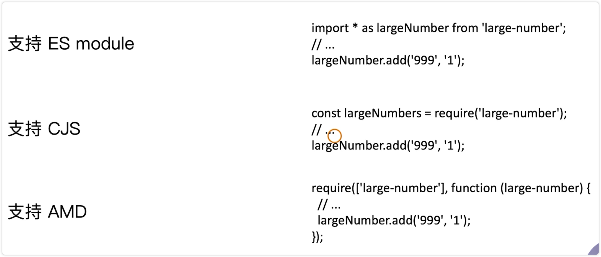
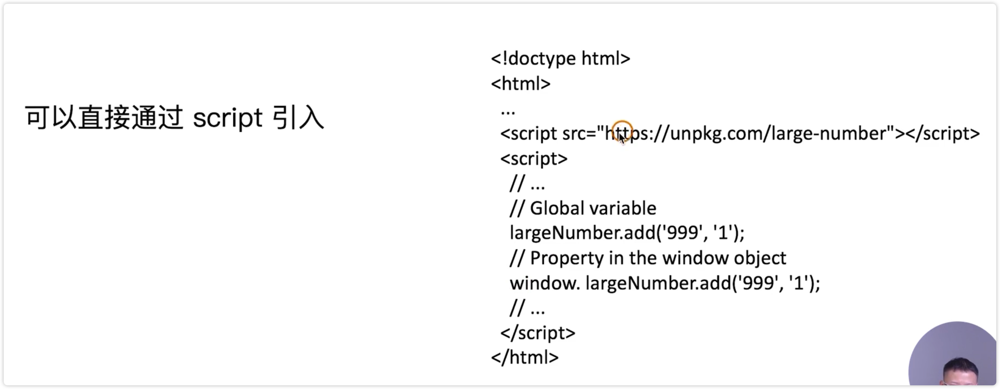
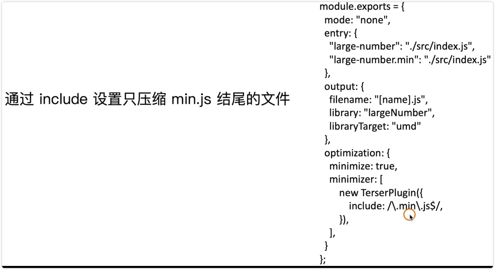
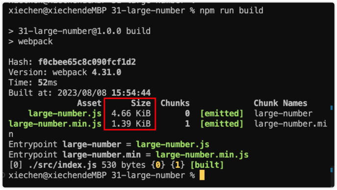

# Webpack 打包库和组件

webpack 除了可以打包项目应用，还可以打包 JS 库

rollup 更加适合打包组件和库，因为它更加的纯粹，而且使用它更加简单。

但是 webpack 比较强大，使用 webpakc 打包的情况也挺多

例如打包一个大整数加法库的打包

1、需要打包压缩包和非压缩包

2、支持 AMD/CJS/ESM 的模块引入







如何把库暴露出去？

打包项目应用和打包库的差别并不大，outpau 需要额外设置一些内容


1、编写 src 下的内容

2、配置 webpack.config.js 文件

3、npm run build 进行打包，发现两个文件都是压缩的

4、指定 min 的文件进行压缩



5、安装 terser-webpack-plugin 这个插件

6、进行编译



7、新增 index.js 文件，区分生产环境和非生产环境的入口

8、发布到 npm 上

9、进行安装使用

```js
import largeNumber from "large-number"
console.log(largeNumber(1000, 2000))
```