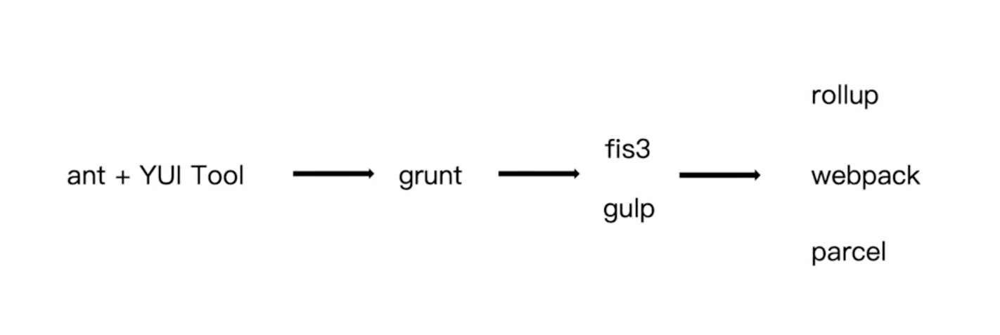

# 前端构建的演变历史

最早的前端都是切图片，编写 HTML、CSS 页面，代码都会进行压缩。

后来大家意识到，代码上线后希望能进行压缩，可以让代码的体积较小也可以让代码的逻辑进行混淆。

当时是使用一些在线工具进行上传压缩，然后拷贝到本地，但是这个过程比较麻烦。

2007 年的时候，YUI Tool 工具出现，可以对 CSS、JS 代码进行压缩。

后来因为前端的模块化的催生，前端的模块化编写过程也越来越复杂，就出现了 grunt。

grunt 会把构建过程分为一个一个的任务，每个任务会执行一个事情。因为任务处理完后会将结果存放在本地磁盘，因为存在本地磁盘 I/O 的操作，导致了打包速度比较慢。

因此，gulp 诞生。gulp 类似 grunt，但是有一个文件流的概念，构建出的的结果并不会存放本地磁盘，而是存放内存中，下一个步骤使用上一个步骤的内存，这样构建速度大大提示。