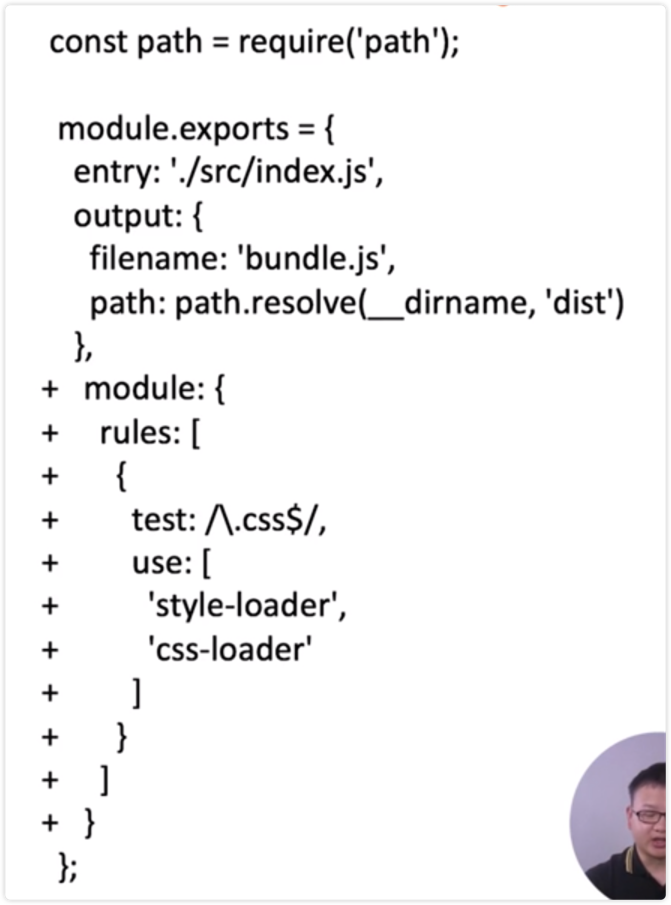
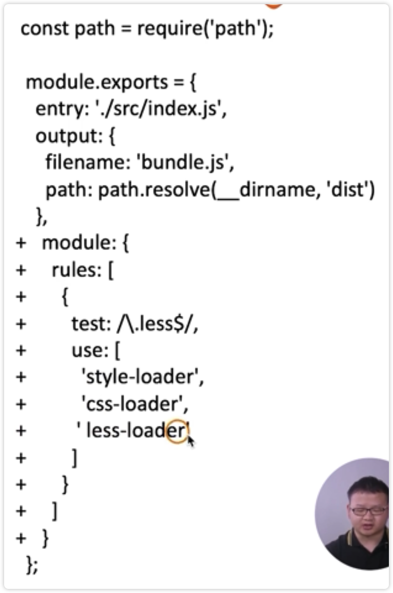

# 解析 CSS、Less 和 Sass

## 解析 CSS

在 webpack 中解析 CSS 文件需要使用 css-loader

css-loader 的作用是加载 .css 文件，并且转化为 commonJS 对象

加载时机是在代码里面，例如 index.js 引入了 css 文件，css-loader 就会在 index.js 里面加载 css 文件，并且转化为 commonJS 对象，插入到 JS 代码里面去

style-loader 的作用是将样式通过 <style></style> 插入到 head 中去

这样样式才会才能在代码显示出来



## 实战

1、安装 

```bash
yarn add style-loader css-loader -D
```

2、新增 search.css 文件并且倒入

3、配置 webpack

4、进行编译

5、dist 下面新建一个 html 文件引入 js 文件最后运行，页面有效果

## 解析 less

日常使用 less、sass 更多，相对 css 功能更强，组织更灵活，封装了一些编程的特性，对于开发更加实用。

要使用 less 也不难，只需要在之前的基础上新增 less-loader 即可

less-loader 的作用就是把一个 less 文件解析成 css 文件



1、安装

yarn add less less-loader -D

因为 less-loader 是需要依赖 less 的，所以需要把 less 也安装上

2、css 文件该问 less

3、配置 webpack

4、编译打包、运行