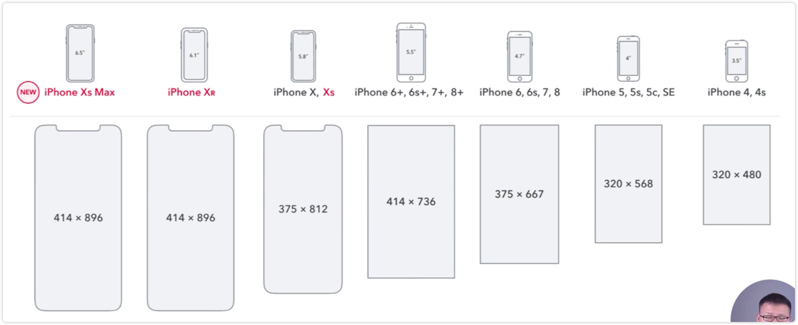
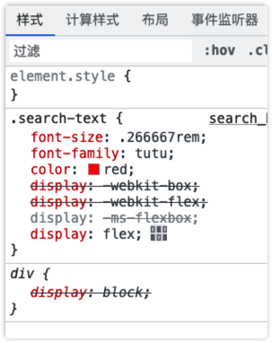

# 移动端 CSS px 自动转换为 rem

浏览器的分辨率

设备的分辨率都在变化，所以需要根据设备的分辨率来动态的改变 px 的值。

需要对所有的页面进行适配。

1、使用 CSS 媒体查询实现

缺点：需要写多套适配样式代码

2、使用 rem 单位

rem 单位是相对于根元素的字体大小来计算的，所以只需要设置根元素的字体大小即可。

在 Webpack 使用 px2rem-loader 插件自动将 px 单位转换为 rem 单位。

页面渲染的时候计算根元素的 font-size 值，可以使用手淘的 lib-flexible 库。

## 示例

1、安装 px2rem-loader 和 lib-flexible 库

2、更改 webpack.prod.js 文件

3、运行编译

4、手动的把 lie-flexible 的代码复制到 search.html 文件中