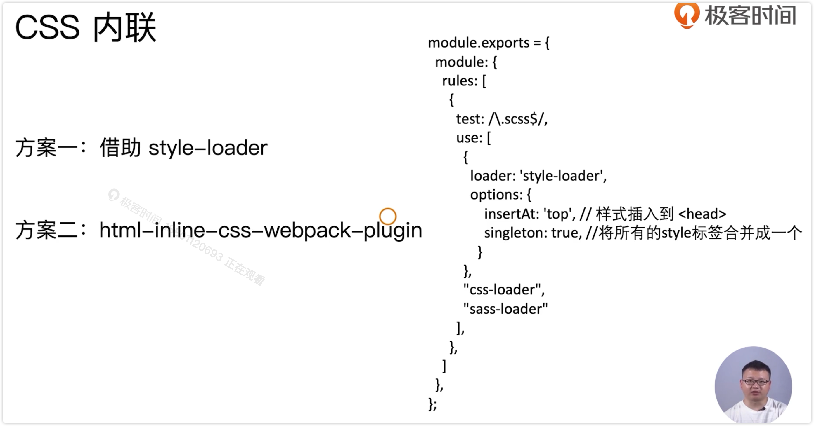
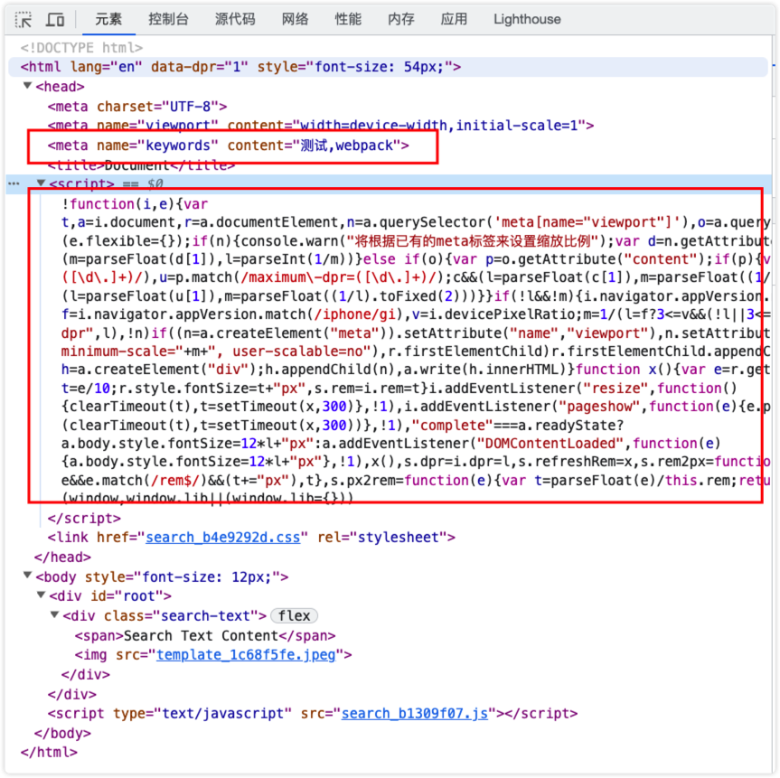

# 静态资源内联

资源内联：将资源文件嵌入到 HTML 页面中。

- 例如一些页面框架的初始化脚本：lie-flexible

- CSS 内联样式避免页面闪动

- 减少 HTTP 请求数

使用 row-loader

内联 JS 文件可能存在 ES6 的语法，还需要使用 babel-loader 进行转换，最后内联进来。

## CSS 内联

html-inline-css-webpack-plugin 针对的是打包好的 chunk 代码内联到 HTML 的 head 标签中去

1、新建 meta.html 文件

2、安装 raw-laoder

3、修改 index.html

因为我们使用的是 html-webpack-plugin 插件，它默认使用的是 ejs 的引擎

4、运行编译

