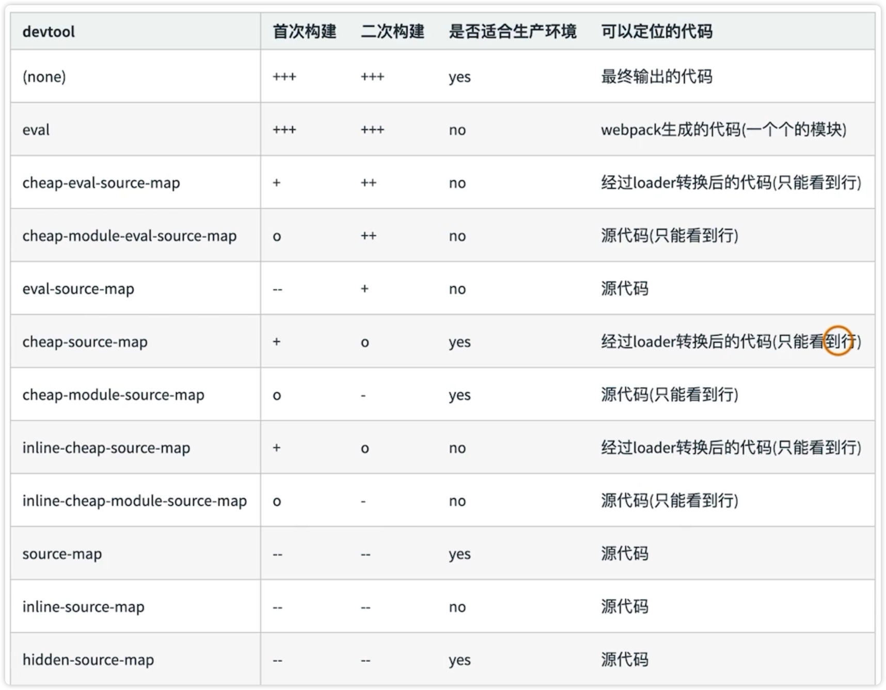
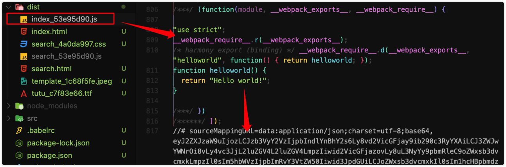
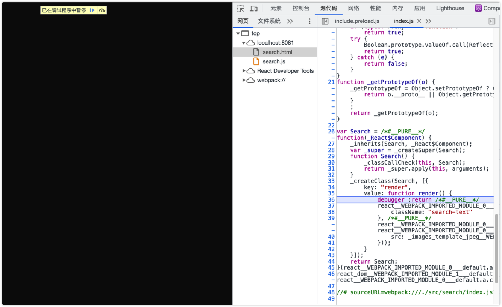

# 使用 source map

Webpack 打包的时候会把源代码打包微一个 bundle 文件，bundle 文件就是经过 loader 处理、插件处理、构建等一些处理，最终生成的 JS 文件

这个 JS 文件是无法直接调试的，所以我们需要使用 source map

一般情况下，source map 是开发环境开启，生产环境关闭。

## source map 的关键字

> eval：会把代码块，在每个代码块的后面显示 source map 文件地址

结合上面的关键字进行分类：

1、修改 mode: none

2、编辑 devtool

3、进行编译

如何进行 soruce map 进行调试呢？

1、修改 search.js 文件

2、运行 npm run dev

代码很难进行调试

3、修改 webpack.dev.js

devtool:"source-map"

4、npm run dev

就可以很容易进行调试了