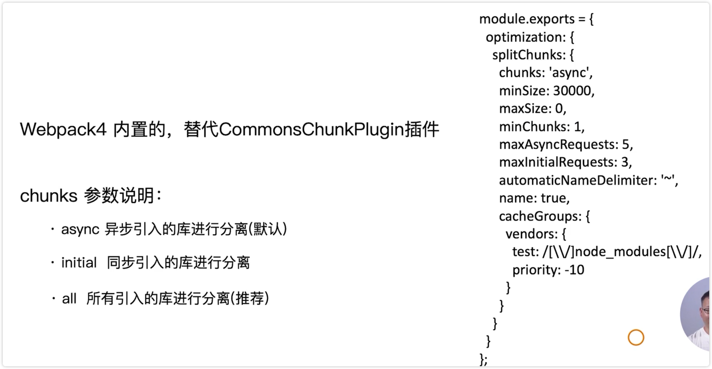

# 提取页面公共资源

日常开发的时候，很多页面都会用到相同的资源，比如：css、js、图片等。

如果每个页面都去引入这些资源，就会造成代码冗余，影响性能。

Webpack 如何进行业务分离？

## 基础库的分离


常见的就是将 react、react-dom 通过 cdn 引入，不打入 bundle 中

还可以使用 Webpack4 内置的 SplitChunksPlugin 进行公共脚本分离



CommonsChunkPlugin 插件是 Webpack3 使用最多的分包工具


```js
module.exports = {
  //...
  optimization: {
    splitChunks: {
      chunks: "async",
      // 抽离的公共包最小的大小（单位：字节）
      minSize: 30000,
      maxSize: 0,
      // 被引入使用的次数
      minChunks: 1,
      // 最大异步请求次数
      maxAsyncRequests: 5,
      // 最大初始化请求数
      maxInitialRequests: 3,
      // 
      automaticNameDelimiter: "~",
      name: true,
      cacheGroups: {
        vendors: {
          test: /[\\/]node_modules[\\/]/,
          priority: -10
        },
        default: {
          minChunks: 2,
          priority: -20,
          reuseExistingChunk: true
        }
      }
    }
  }
};
```

## splitChunks 的用法

1、分离基础包

- 新增 optimization 

- 给 HtmlWebpackPlugin 新增 vendor 包

- 运行

2、公共包分离

- 更改目录结构

- 配置 webpack.prod.js

- 运行
