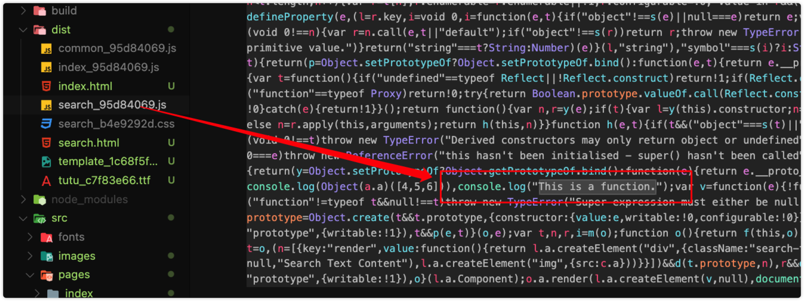
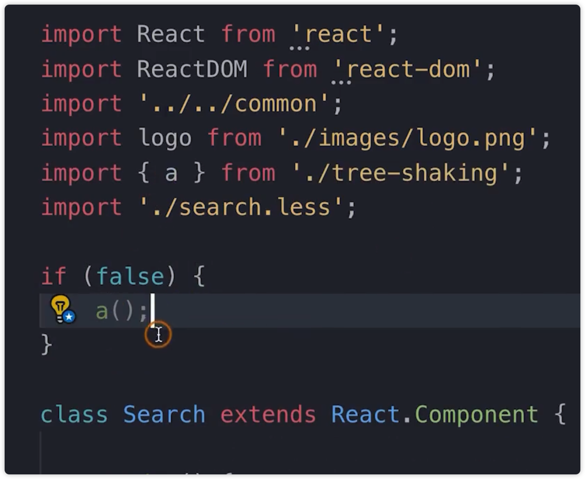

# Tree Shaking 的使用和原理分析

Tree shaking 摇树，形象的说明了它的工作原理，即在打包时，去除无用的代码。

一个模块可能有多个方法，只要其中的某个方法被用到了，则整个文件都会被打包到 bundle 里面去，tree shaking 的作用就是只把用到的方法打入到 bundle 里面去，没用到的方法不会被打包到 bundle 里面去。

Webpack 默认支持的，在 .babelrc 文件中配置了 `modules: false` 即可。

prduction 模式下，tree shaking 默认是开启的。

要求必须是 ES6 的语法，CommonJS 是不支持的。

## 原理

- 利用了 ES6 模块的特点：

    - 只能作为模块的顶层出现

    - import 的模块名只能是字符串常量

    - import binding 是 immutable 的

本质上还是对代码静态的分析，编译的时候就要确定下来哪些代码是被使用的。将无用的代码进行擦除。

## 实践

1、search/tree-shaking.js

2、search/index.js 进行引入

3、mode：node 默认关闭 tree-shaking，prodduction 默认开启

4、运行查看结果

5、更改 mode

6、查看结果

这样的情况，也会进行 tree-shaking，因为 a 函数永远不会被执行

