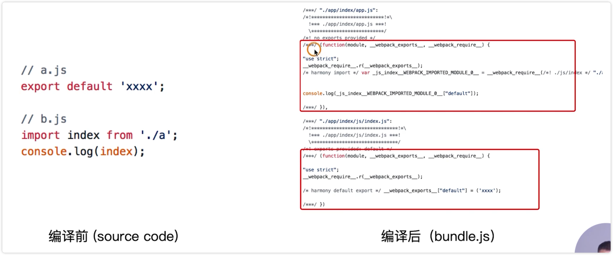

# Scope Hoisting 的使用和原理分析

构建之后的代码存在大量的闭包代码。

会导致什么问题？

1、大量函数闭包包裹代码，导致体积增大（模块越多越明显）

2、运行嗲吗的时候创建的函数作用域变多，内存开销变大

为什么打包后会变成这么多的函数包裹进行包裹呢？

1、模块转换分析

- 总结：

- 被 webpack 转换后的模块会带上一层包裹

- import 会被转换成 _webpack_require 函数调用

TOOD，本节没学懂