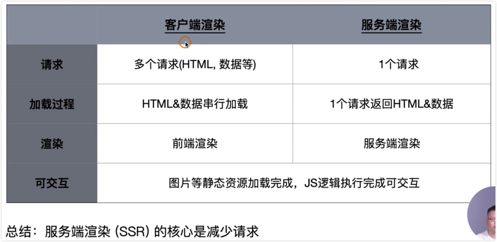
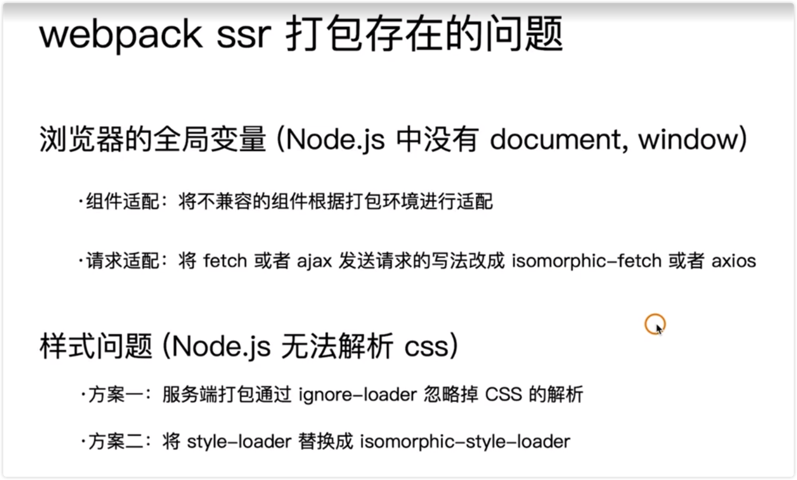

# Webpack 打包 SSR（上）

SSR 服务端渲染。

客户端渲染的过程：

整个过程：串行执行的，先加载 HTML 再加载 CSS 和 JS，再加载数据，最后达到页面可交互的状态。

服务端渲染是为了优化白屏时间，渲染： HTML + CSS + JS + 数据 => 渲染后的 HTML

服务端：

所有的模版等资源豆存储在服务端；

内网机器拉取数据更快；

一个 HTML 返回所有的数据；

## 浏览器和服务器交互的流程

## 客户端渲染和服务端渲染的对比

服务端渲染的优点：

1、减少白屏时间

2、对于 SEO 更加友好

## SSR 代码实现的思路

## 演示

1、新建一个 webpack.ssr.js 文件专门用于打包服务端渲染，进行编辑

2、配置 package.json 文件一个命令

3、创建文件夹 server

4、安装 express

5、编写 server 文件夹下的 index.js 文件

6、新建一个 pages/search/search-server.js 文件，并进行编写

7、进行打包

## webpack ssr 打包存在的问题

