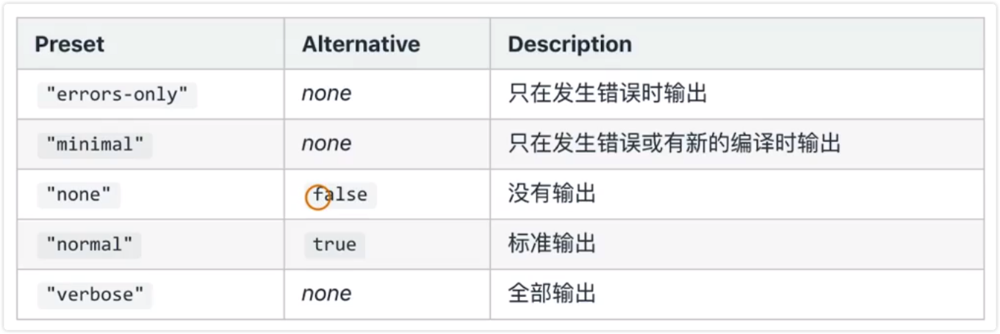
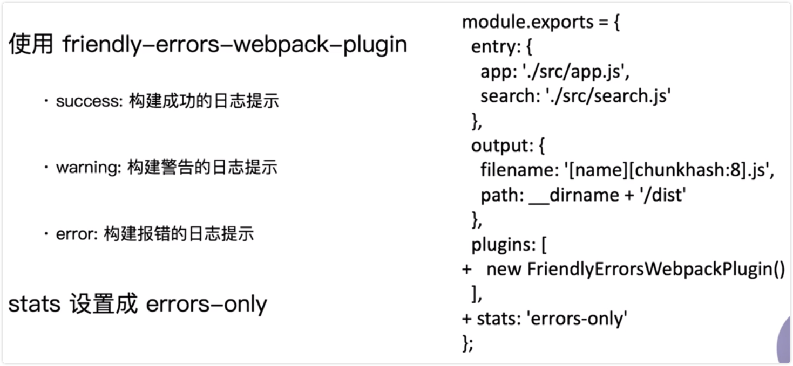

# 优化构建时命令行的显示日志

目前每次运行构建的时候，展示一大堆日志，很多并不需要开发者进行关注

## 统计信息 stats

用来输出统计的一个信息，通常用来分析构建的耗时

如果不设置默认把所有的信息都输出！

## 案例

1、修改 webpack.prod.js 文件

## 如何优化命令行的构建日志

使用 friendly-errors-webpack-plugin 插件

## 演示

1、安装 friendly-errors-webpack-plugin

2、更改 webpack.dev.js 和 webpack.prod.js 文件

3、运行 npm run dev 和 npm run build