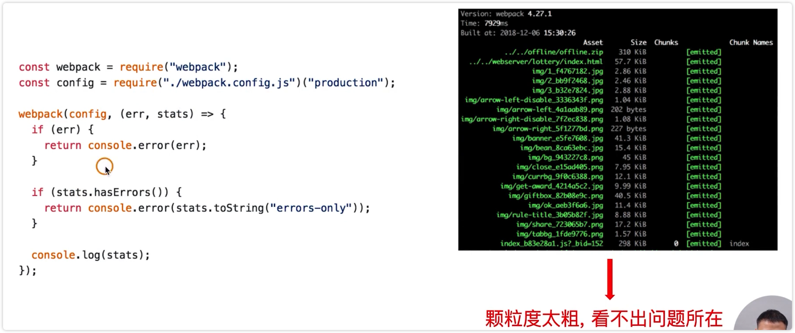

# 使用 Webpack 内置的 stats

Webpack 如何分析构建速度和构建体积？

1、使用 Webpack 内置的 stats 功能

2、在 NodeJS 中使用

上面两种方案的缺点：颗粒度太粗，看不出问题所在。

## 演示

1、更改 package.json 文件新增一个 build:stats 的命令

2、运行命令生成一个 stats.json 文件

这个文件不是非常直观，需要借助一些工具来分析