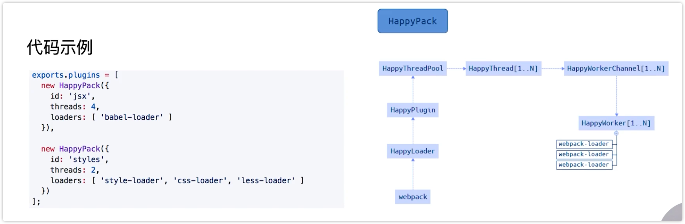

# 多进程/多实例构建：资源并行解析可选方案

可选方案：

## HappyPack 解析资源

原理：每次 Webpack 解析一个模块，HappyPack 会将这个模块及模块的依赖分配给 worker 线程中。

HappyPack 在 Webpack3 中使用的比较多，但是库的作者现在基本不维护了，Webpack4 提供了 thread-loader 可以替换 HappyPack 来实现多进程的工作。

## 演示

1、安装 thread-loader

2、更改 webpack.prod.js