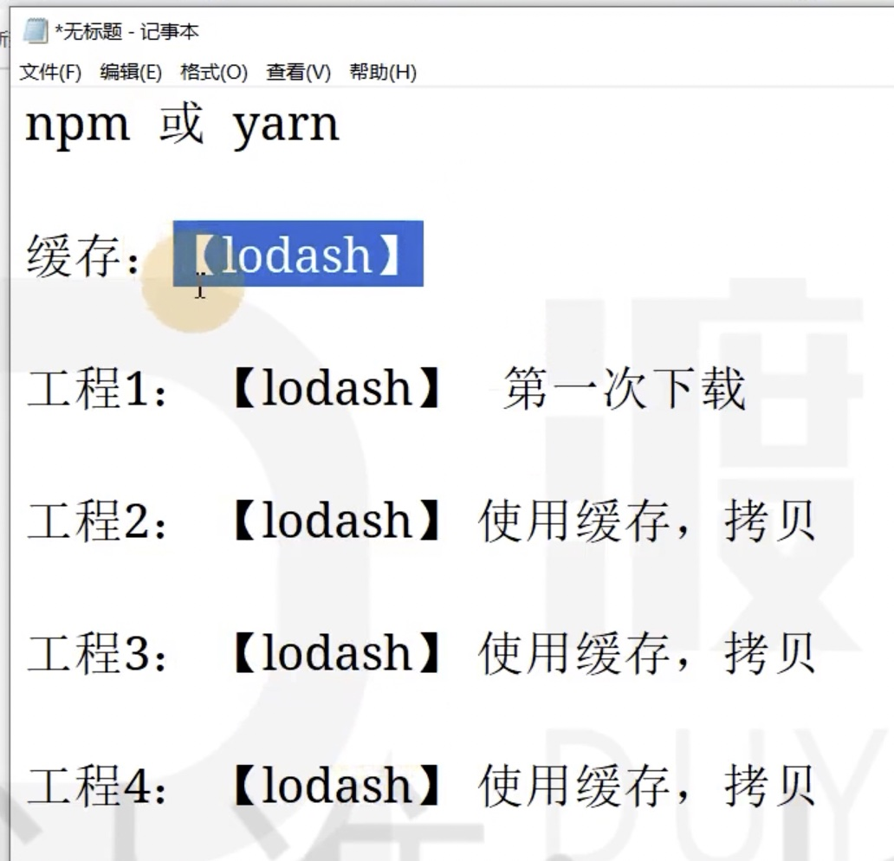
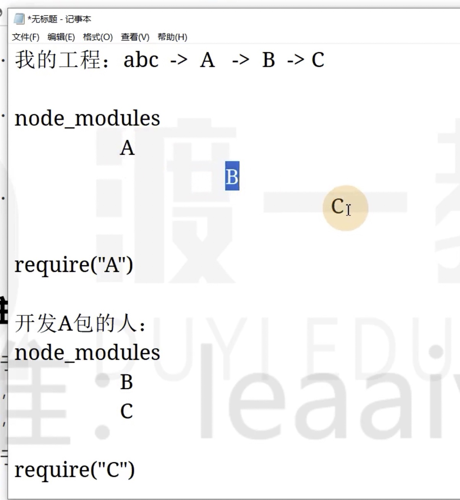

# 16 pnpm

pnpm 是一种新的包管理器。

优势：

1、安装效率高于 npm 和 yarn

2、极其精简的 node_modules 

3、避免了开发时使用间接依赖的问题

4、能极大的降低磁盘空间的占用

pnpm 和 npm 的大部分命令都一致。

可以看到 node_modules 的目录非常的精简，我们只能 require("mocha") 这个模块，没有显示 mocha 的依赖模块，无法使用 mocha 的间接依赖。

```js
// pnpm
require("diff")
```

```js
// pnpm
require("diff")
```

<!-- 自己截图对比 -->

yarn 或者 npm 可以使用间接依赖（mocha 的依赖），我们的 package.json 里没有显示的声明，但是可以正常使用。

如果要执行本地的 CLI，可以使用 pnpx 命令，这个和 npm 的 npx 是一样的。

区别：

使用 npx mocha 执行本地的 mocha，如果 mocha 没有安装，则 npx 会自动的、临时的安装 mocha，安装完成后自动运行

pnpx 是使用 pnpx 进行安装，唯一的区别。

## pnpm 的原理

1、和 yarn、npm 一样，也是使用缓存、使用锁文件。

2、使用符号链接和硬链接的做法来放置依赖。



一直在拷贝，白白浪费磁盘空间。

3、规避了 window 操作系统路径太长的问题。

## 注意事项

pnpm 会改变 node_modules 的目录结构，每个包只能使用直接依赖，不能使用间接依赖。

